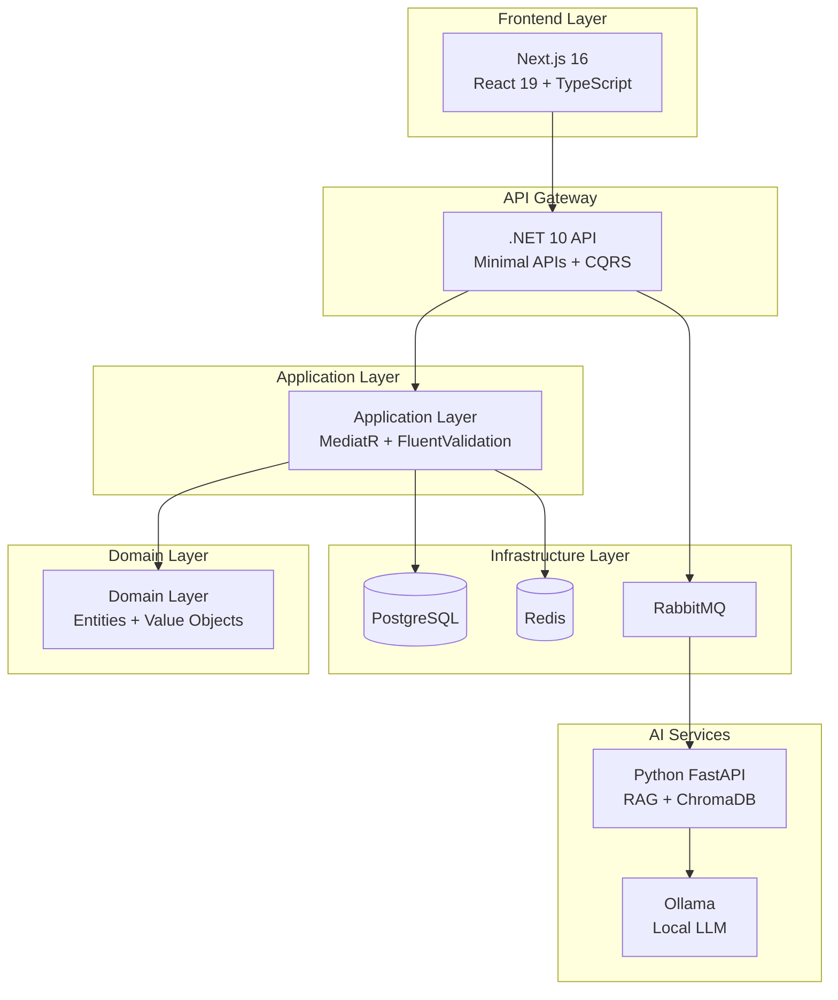

# MrBekoXBlogApp

A modern, full-stack blog platform with AI-powered content assistance, built with clean architecture principles and event-driven microservices.


## Features

- **Content Management**: Create, edit, publish blog posts with markdown support
- **AI-Powered Assistance**:
  - Automatic title generation
  - Content improvement suggestions
  - SEO description and excerpt generation
  - Smart tag recommendations
- **Real-time Features**: Cache invalidation via SignalR
- **Search**: Full-text search with optimized queries
- **SEO**: Automatic sitemap, robots.txt, and structured data
- **Security**: JWT authentication, rate limiting, CSRF protection, input sanitization

## Architecture



## Tech Stack

### Backend
- **.NET 10** with Clean Architecture
- **CQRS** with MediatR
- **EF Core** for ORM
- **PostgreSQL** as primary database
- **Redis** for caching and sessions
- **RabbitMQ** for event-driven messaging
- **SignalR** for real-time updates
- **Serilog** for structured logging
- **OpenTelemetry** for observability

### Frontend
- **Next.js 16** with App Router
- **React 19** with TypeScript
- **TailwindCSS** for styling
- **shadcn/ui** component library
- **Zustand** for state management
- **Axios** for HTTP requests
- **React Markdown** for content rendering

### AI Services
- **Python 3.13** with FastAPI
- **ChromaDB** for vector storage
- **Ollama** for local LLM inference
- **RAG** (Retrieval-Augmented Generation)
- **BM25** for keyword search
- **Semantic chunking** for better embeddings

## Quick Start

### Prerequisites
- Docker and Docker Compose
- .NET 10 SDK (for local development)
- Node.js 20+ (for local development)
- Python 3.13+ (for AI service local development)
- Ollama with `gemma3:4b` model

### Using Docker (Recommended)

```bash
# Clone the repository
git clone https://github.com/yourusername/MrBekoXBlogApp.git
cd MrBekoXBlogApp

# Copy environment template
cp docker/.env.example docker/.env

# Edit docker/.env and set your passwords
nano docker/.env

# Start all services
cd docker && docker-compose up -d

# Run database migrations
docker-compose exec backend dotnet ef database update

# Access the application
# Frontend: http://localhost:3000
# Backend API: http://localhost:8080
# API Swagger: http://localhost:8080/swagger
# RabbitMQ Management: http://localhost:15672
```

### Local Development

#### Backend
```bash
cd src/BlogApp.Server/BlogApp.Server.Api
dotnet restore
dotnet run
```

#### Frontend
```bash
cd src/blogapp-web
npm install
npm run dev
```

#### AI Service
```bash
cd src/services/ai-agent-service
python -m venv venv
source venv/bin/activate  # On Windows: venv\Scripts\activate
pip install -r requirements.txt
python -m app.main
```

## Environment Variables

### Backend (.NET)

| Variable | Description | Default | Required |
|----------|-------------|---------|----------|
| `ConnectionStrings__DefaultConnection` | PostgreSQL connection string | - | Yes |
| `ConnectionStrings__Redis` | Redis connection string | localhost:6379 | Yes |
| `JwtSettings__Secret` | JWT signing key (min 32 chars) | - | Yes |
| `JwtSettings__Issuer` | JWT issuer | BlogApp | No |
| `JwtSettings__Audience` | JWT audience | BlogApp | No |
| `RabbitMQ__HostName` | RabbitMQ host | localhost | Yes |
| `RabbitMQ__Port` | RabbitMQ port | 5672 | No |
| `RabbitMQ__UserName` | RabbitMQ username | - | Yes |
| `RabbitMQ__Password` | RabbitMQ password | - | Yes |
| `AdminUser__Email` | Admin user email | - | Yes |
| `AdminUser__Password` | Admin password | - | Yes |

### Frontend (Next.js)

| Variable | Description | Default | Required |
|----------|-------------|---------|----------|
| `NEXT_PUBLIC_API_URL` | Backend API URL | http://localhost:8080/api/v1 | Yes |
| `NEXT_PUBLIC_SITE_URL` | Site URL for SEO | http://localhost:3000 | No |

### AI Service (Python)

| Variable | Description | Default | Required |
|----------|-------------|---------|----------|
| `OLLAMA_BASE_URL` | Ollama API URL | http://localhost:11434 | No |
| `OLLAMA_MODEL` | Model to use | gemma3:4b | No |
| `REDIS_URL` | Redis connection string | redis://localhost:6379/0 | Yes |
| `RABBITMQ_HOST` | RabbitMQ host | localhost | Yes |
| `RABBITMQ_USER` | RabbitMQ username | - | Yes |
| `RABBITMQ_PASS` | RabbitMQ password | - | Yes |
| `CHROMA_PERSIST_DIR` | ChromaDB storage path | ./chroma_data | No |

## API Endpoints

### Authentication
- `POST /api/v1/auth/register` - Register new user
- `POST /api/v1/auth/login` - Login
- `POST /api/v1/auth/refresh` - Refresh access token

### Posts
- `GET /api/v1/posts` - List posts (paginated)
- `GET /api/v1/posts/{slug}` - Get post by slug
- `POST /api/v1/posts` - Create post (auth required)
- `PUT /api/v1/posts/{id}` - Update post (auth required)
- `DELETE /api/v1/posts/{id}` - Delete post (auth required)
- `POST /api/v1/posts/publish` - Publish post (auth required)

### AI Features
- `POST /api/v1/ai/generate-title` - Generate AI title
- `POST /api/v1/ai/generate-excerpt` - Generate excerpt
- `POST /api/v1/ai/generate-tags` - Generate tags
- `POST /api/v1/ai/improve-content` - Improve content
- `POST /api/v1/ai/analyze` - Analyze content

## Cache Strategy

The application uses a hybrid caching strategy:

1. **In-Memory Cache**: Fast local cache using IMemoryCache
2. **Redis Cache**: Distributed cache for multi-instance scenarios
3. **Output Caching**: HTTP response caching for GET endpoints
4. **Cache Invalidation**: Real-time invalidation via SignalR

### Cache Keys
- Posts: `posts:list:*`, `posts:slug:*`
- Categories: `categories:list`, `categories:id:*`
- Tags: `tags:list`, `tags:id:*`

## Security Features

- **JWT Authentication**: Secure token-based authentication
- **Rate Limiting**: IP-based rate limiting with configurable rules
- **CSRF Protection**: Anti-forgery tokens for state-changing operations
- **Input Sanitization**: HTML sanitization for user content
- **CORS**: Configurable CORS policy
- **Security Headers**: OWASP recommended headers
- **Password Requirements**: Minimum 12 characters with complexity rules

## Observability

The application uses OpenTelemetry for distributed tracing:

- **Metrics**: Exposed at `/metrics` endpoint (Prometheus format)
- **Logging**: Structured logging with Serilog
- **Health Checks**: `/health` endpoint for all dependencies

## Troubleshooting

### Database Connection Issues
```bash
# Check PostgreSQL is running
docker-compose ps postgres

# View logs
docker-compose logs postgres
```

### AI Service Not Responding
```bash
# Ensure Ollama is running
ollama list

# Pull required model
ollama pull gemma3:4b
```

### Redis Connection Errors
```bash
# Check Redis status
docker-compose ps redis

# Test connection
docker-compose exec redis redis-cli ping
```

## Contributing

Please see [CONTRIBUTING.md](CONTRIBUTING.md) for guidelines.

## License

This project is licensed under the MIT License - see [LICENSE](LICENSE) for details.

## Security

For security policies, please see [SECURITY.md](SECURITY.md).

## Changelog

See [CHANGELOG.md](CHANGELOG.md) for version history.
