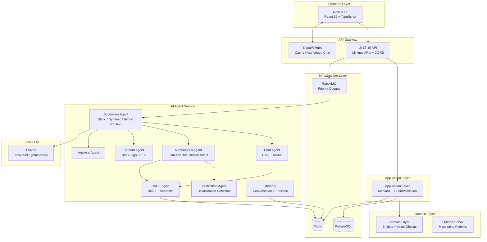

# MrBekoXBlogApp

A modern, full-stack blog platform with AI-powered content assistance, autonomous agent orchestration, and event-driven microservices — built with clean architecture principles.


## Features

- **Content Management**: Create, edit, publish blog posts with markdown and code highlighting support
- **AI-Powered Assistance**:
  - Automatic title, excerpt, and tag generation
  - Content improvement and summarization
  - SEO description and keyword extraction
  - Sentiment analysis and reading time calculation
  - Geographic content optimization
- **Autonomous AI Agent**: Plan-Execute-Reflect-Adapt loop with episodic memory and hallucination verification
- **Hybrid RAG Search**: BM25 keyword + semantic vector search with ChromaDB
- **Real-time Features**: SignalR hubs for cache invalidation, authoring events, and live chat
- **Chat System**: AI-powered chat with RAG context, abuse protection, and session memory
- **Message Backpressure**: Priority queues, circuit breaker, and graceful degradation
- **Search**: Full-text search with AI-powered ranking
- **SEO**: Automatic sitemap, robots.txt, and structured data
- **Security**: JWT authentication, rate limiting, CSRF protection, input sanitization, Turnstile CAPTCHA

## Architecture



## Tech Stack

### Backend
- **.NET 10** with Clean Architecture (Domain / Application / Infrastructure / API)
- **CQRS** with MediatR + FluentValidation pipeline behaviors
- **Minimal APIs** with route grouping and versioning
- **EF Core** with entity-specific repositories
- **Outbox & Inbox patterns** for reliable event delivery
- **PostgreSQL** as primary database
- **Redis** for caching, sessions, and agent state
- **RabbitMQ** for event-driven messaging with priority queues
- **SignalR** for real-time updates (`/hubs/public-cache`, `/hubs/authoring-events`, `/hubs/chat-events`)
- **Serilog** for structured logging
- **OpenTelemetry** for observability

### Frontend
- **Next.js 16** with App Router
- **React 19** with TypeScript
- **TailwindCSS v4** for styling
- **Radix UI** component primitives
- **Zustand** for state management
- **Axios** for HTTP requests
- **@microsoft/signalr v10** for real-time features
- **React Markdown** + `remark-gfm` + `react-syntax-highlighter` for content rendering
- **React Hook Form** + Zod for validation
- **Vitest** for unit testing

### AI Agent Service
- **Python 3.13** with FastAPI
- **LangGraph** for stateful agent orchestration
- **ChromaDB** for vector storage
- **Ollama** for local LLM inference (`phi4-mini`, `gemma3:4b`)
- **sentence-transformers** + `nomic-embed-text` for embeddings
- **Hybrid search**: BM25 (`rank-bm25`) + semantic vector search
- **Semantic chunking** for better embedding quality
- **aio-pika** for async RabbitMQ integration
- **Redis** for conversation state and multi-level caching
- **Prometheus** metrics
- **dependency-injector** for DI container

## AI Agent System

### Supervisor (Orchestrator)
Routes incoming events to specialized agents via three strategies:

| Strategy | When Used | How |
|----------|-----------|-----|
| **Static** | Known event types | Direct mapping (fast, deterministic) |
| **Dynamic** | Unknown/ambiguous events | LLM-based intent classification |
| **Hybrid** | Chat requests | Complexity assessment → simple (ReAct) or complex (Autonomous) |

### Specialized Agents

- **ChatAgent** — RAG + ReAct reasoning for conversational Q&A with memory
- **AutonomousAgent** — Plan → Execute → Reflect → Adapt loop (max 15 iterations, 2 replans)
- **ContentAgent** — Title, excerpt, tag, and SEO description generation
- **AnalysisAgent** — Article analysis, summarization, keyword extraction, sentiment
- **SeoAgent** — Meta descriptions, geographic optimization, keyword ranking
- **VerificationAgent** — Post-generation hallucination detection and correction (non-blocking, 5s timeout)
- **PlannerAgent** + **PlanValidator** — Plan creation and validation against available tools

### Memory Systems

| System | Storage | Purpose |
|--------|---------|---------|
| Conversation Memory | Redis | Short-term session history |
| Episodic Memory | Redis | Learning from successful executions |
| LangGraph Checkpointing | Redis | State persistence and recovery |

### Tools Available to Agents
- `rag_tool` — Hybrid BM25 + semantic retrieval from ChromaDB
- `web_search_tool` — DuckDuckGo integration for live information
- Content and SEO tools for generation tasks

## Message Backpressure System

Protects against queue overload with:
- **Priority queues** — Critical messages processed first
- **Queue depth monitoring** — `IQueueDepthService` tracks depth in real time
- **Circuit breaker** — Opens when depth exceeds threshold
- **Graceful degradation** — Partial responses returned when overloaded
- **Estimated wait time** — Frontend can display queue status to users

## Domain Model

```
BlogPost      — Title, Slug, Content, Status, IsFeatured, SEO fields, ViewCount
Category      — Name, Slug, Description → many Posts
Tag           — Name, Slug → many Posts (M-M)
User          — Email, PasswordHash, Role (Author / Editor / Admin)
Comment       — PostId, AuthorId, Content
RefreshToken  — UserId, Token, Expiry
OutboxMessage — EventType, Payload, IsProcessed (Outbox pattern)
InboxMessage  — EventType, Payload, IsProcessed (Inbox pattern)
IdempotencyRecord — OperationId, StatusCode, Response
```

## API Endpoints

### Authentication
| Method | Path | Description |
|--------|------|-------------|
| POST | `/api/v1/auth/register` | Register new user |
| POST | `/api/v1/auth/login` | Login (returns JWT) |
| POST | `/api/v1/auth/refresh-token` | Refresh access token |
| POST | `/api/v1/auth/logout` | Logout |

### Posts
| Method | Path | Description |
|--------|------|-------------|
| GET | `/api/v1/posts` | List posts (paginated, search, filter, sort) |
| GET | `/api/v1/posts/featured` | Featured posts |
| GET | `/api/v1/posts/slug/{slug}` | Get post by slug (public) |
| GET | `/api/v1/posts/{id}` | Get post by ID (auth required) |
| POST | `/api/v1/posts` | Create post (draft) |
| PUT | `/api/v1/posts/{id}` | Update post |
| DELETE | `/api/v1/posts/{id}` | Delete post |
| POST | `/api/v1/posts/{id}/publish` | Publish post |
| POST | `/api/v1/posts/{id}/save-draft` | Save draft |

### AI Features
| Method | Path | Description |
|--------|------|-------------|
| POST | `/api/v1/ai/generate-title` | Generate AI title |
| POST | `/api/v1/ai/generate-excerpt` | Generate excerpt |
| POST | `/api/v1/ai/generate-tags` | Generate tags |
| POST | `/api/v1/ai/summarize` | Summarize content |
| POST | `/api/v1/ai/improve-content` | Improve content quality |
| POST | `/api/v1/ai/extract-keywords` | Extract keywords |
| POST | `/api/v1/ai/generate-seo-description` | SEO meta description |
| POST | `/api/v1/ai/analyze-sentiment` | Sentiment analysis |
| POST | `/api/v1/ai/calculate-reading-time` | Reading time |
| POST | `/api/v1/ai/collect-sources` | Collect content sources |
| POST | `/api/v1/ai/geo-optimize` | Geographic optimization |

### Chat
| Method | Path | Description |
|--------|------|-------------|
| POST | `/api/v1/chat/message` | Send chat message |
| GET | `/api/v1/chat/sessions` | Get user sessions |
| GET | `/api/v1/chat/sessions/{id}` | Get session messages |
| DELETE | `/api/v1/chat/sessions/{id}` | Delete session |

### SignalR Hubs
| Hub | Path | Auth | Purpose |
|-----|------|------|---------|
| PublicCacheHub | `/hubs/public-cache` | Anonymous | Cache invalidation broadcasts |
| AuthoringEventsHub | `/hubs/authoring-events` | Required | Real-time post editing updates |
| ChatEventsHub | `/hubs/chat-events` | Required | Live chat notifications |

## Caching Strategy

1. **L1 — Redis**: Conversation sessions, RAG results, embedding cache
2. **L2 — Local Memory**: Fallback cache for Redis failures
3. **Output Caching**: HTTP response caching on GET endpoints
4. **Cache Invalidation**: Real-time via SignalR `PublicCacheHub`

### Cache Keys
- Posts: `posts:list:*`, `posts:slug:*`
- Categories: `categories:list`, `categories:id:*`
- Tags: `tags:list`, `tags:id:*`

## Security Features

- **JWT Authentication** with refresh token rotation
- **Role-Based Access Control** (Author / Editor / Admin)
- **Chat Abuse Protection**: Turnstile CAPTCHA, client fingerprinting, IP rate limiting, session tracking
- **Rate Limiting**: IP-based with configurable rules
- **CSRF Protection**: Anti-forgery tokens for state-changing operations
- **Input Sanitization**: HTML sanitization for user content
- **Service-to-Service Auth**: Internal service key validation
- **Log Sanitization**: PII removal from all log output
- **Idempotency**: OperationId-based request deduplication
- **Security Headers**: OWASP recommended headers
- **Password Requirements**: Minimum 12 characters with complexity rules

## Quick Start

### Prerequisites
- Docker and Docker Compose
- .NET 10 SDK (local development)
- Node.js 20+ (local development)
- Python 3.13+ (AI service local development)
- Ollama with `phi4-mini` or `gemma3:4b` model

### Using Docker (Recommended)

```bash
# Clone the repository
git clone https://github.com/yourusername/MrBekoXBlogApp.git
cd MrBekoXBlogApp

# Copy environment template
cp docker/.env.example docker/.env

# Edit docker/.env and set required values
nano docker/.env

# Start all services
cd docker && docker-compose up -d

# Run database migrations
docker-compose exec backend dotnet ef database update

# Access the application
# Frontend:           http://localhost:3000
# Backend API:        http://localhost:8080
# Swagger UI:         http://localhost:8080/swagger
# RabbitMQ Console:   http://localhost:15672
# AI Agent Service:   http://localhost:8000
```

### Local Development

#### Backend
```bash
cd src/BlogApp.Server/BlogApp.Server.Api
dotnet restore
dotnet run
```

#### Frontend
```bash
cd src/blogapp-web
npm install
npm run dev
```

#### AI Agent Service
```bash
cd src/services/ai-agent-service
python -m venv venv
source venv/bin/activate  # Windows: venv\Scripts\activate
pip install -r requirements.txt
python -m app.main
```

## Environment Variables

### Backend (.NET)

| Variable | Description | Required |
|----------|-------------|----------|
| `ConnectionStrings__DefaultConnection` | PostgreSQL connection string | Yes |
| `ConnectionStrings__Redis` | Redis connection string | Yes |
| `JwtSettings__Secret` | JWT signing key (min 32 chars) | Yes |
| `JwtSettings__Issuer` | JWT issuer | No |
| `JwtSettings__Audience` | JWT audience | No |
| `RabbitMQ__HostName` | RabbitMQ host | Yes |
| `RabbitMQ__Port` | RabbitMQ port (default: 5672) | No |
| `RabbitMQ__UserName` | RabbitMQ username | Yes |
| `RabbitMQ__Password` | RabbitMQ password | Yes |
| `AdminUser__Email` | Admin user email | Yes |
| `AdminUser__Password` | Admin password | Yes |

### Frontend (Next.js)

| Variable | Description | Required |
|----------|-------------|----------|
| `NEXT_PUBLIC_API_URL` | Backend API URL | Yes |
| `NEXT_PUBLIC_SITE_URL` | Site URL for SEO | No |

### AI Agent Service (Python)

| Variable | Description | Default | Required |
|----------|-------------|---------|----------|
| `OLLAMA_BASE_URL` | Ollama API URL | `http://localhost:11434` | No |
| `OLLAMA_MODEL` | Model name | `phi4-mini` | No |
| `OLLAMA_TIMEOUT` | Request timeout (seconds) | `120` | No |
| `REDIS_URL` | Redis connection string | `redis://localhost:6379/0` | Yes |
| `RABBITMQ_HOST` | RabbitMQ host | `localhost` | Yes |
| `RABBITMQ_USER` | RabbitMQ username | — | Yes |
| `RABBITMQ_PASS` | RabbitMQ password | — | Yes |
| `CHROMA_PERSIST_DIR` | ChromaDB storage path | `./chroma_data` | No |
| `AGENT_MAX_ITERATIONS` | Max autonomous agent steps | `15` | No |
| `AGENT_MAX_REPLANS` | Max replanning attempts | `2` | No |
| `AGENT_VERIFICATION_ENABLED` | Enable hallucination check | `true` | No |
| `IDLE_SHUTDOWN_ENABLED` | Auto-shutdown on idle | `false` | No |
| `IDLE_TIMEOUT_SECONDS` | Idle timeout | `1800` | No |
| `RATE_LIMIT_REQUESTS_PER_MINUTE` | Rate limit per IP | `60` | No |

## Observability

- **Metrics**: Prometheus-format metrics at `/metrics` (AI service) and `/metrics` (backend)
- **Logging**: Structured logging with Serilog (backend) and contextualized Python logging (AI service), with PII sanitization
- **Health Checks**: `/health` endpoint on all services (checks DB, Redis, RabbitMQ)
- **Distributed Tracing**: OpenTelemetry-ready with correlation IDs

## Troubleshooting

### Database Connection Issues
```bash
docker-compose ps postgres
docker-compose logs postgres
```

### AI Service Not Responding
```bash
# Ensure Ollama is running and model is available
ollama list
ollama pull phi4-mini
```

### Redis Connection Errors
```bash
docker-compose ps redis
docker-compose exec redis redis-cli ping
```

### RabbitMQ Queue Issues
```bash
# Check queue depth via management UI
open http://localhost:15672
# Or via CLI
docker-compose exec rabbitmq rabbitmqctl list_queues
```
