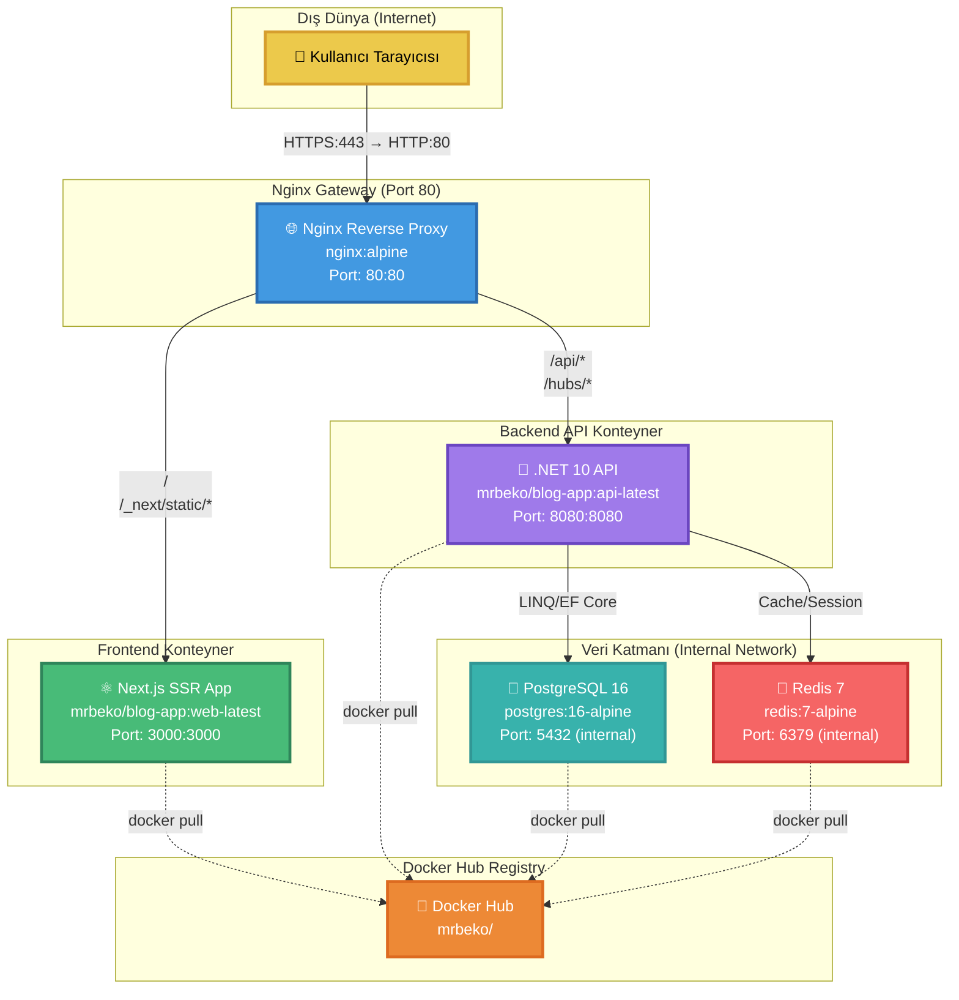
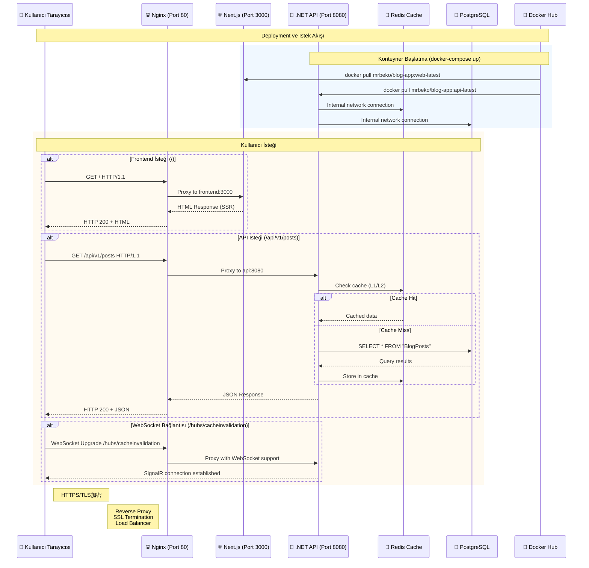
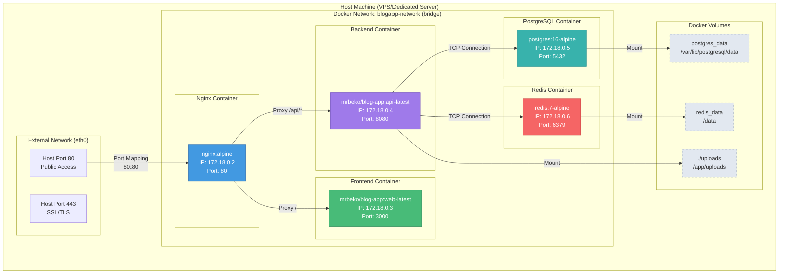
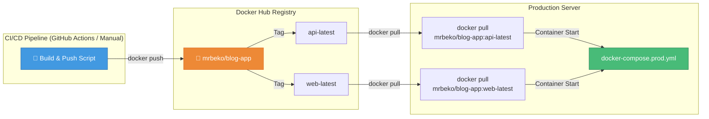

# BlogApp - Teknik Mimari Dokümanı

**Sürüm:** 1.0
**Son Güncelleme:** 2026-01-14
**Mimari:** Clean Architecture (Onion) + Microservices
**Deployment:** Docker Compose + Docker Hub

---

## 📋 İçindekiler

1. [Sistem Genel Bakış](#sistem-genel-bakış)
2. [Sistem Mimarisi Diyagramları](#sistem-mimarisi-diyagramları)
3. [Bileşen Detayları](#bileşen-detayları)
4. [Trafik Yönlendirme Stratejisi](#trafik-yönlendirme-stratejisi)
5. [Teknoloji Yığını](#teknoloji-yığını)
6. [Docker Hub ve Konteyner Yapısı](#docker-hub-ve-konteyner-yapısı)
7. [Network ve Güvenlik](#network-ve-güvenlik)
8. [Deployment Akışı](#deployment-akışı)

---

## 🎯 Sistem Genel Bakış

BlogApp, modern bir blog platformu olarak **mikroservis mimarisi** ile tasarlanmıştır. Sistem üç ana konteynerden ve iki veritabanı servisinden oluşmaktadır:

```
┌─────────────────────────────────────────────────────────────┐
│                     Dış Dünya (Internet)                     │
│                     HTTPS:443 → HTTP:80                      │
└──────────────────────────────┬──────────────────────────────┘
                               │
                               ▼
┌─────────────────────────────────────────────────────────────┐
│                   Nginx Reverse Proxy                         │
│                   nginx:alpine (Docker Hub)                  │
│                   Port: 80 (Host) → 80 (Container)          │
└──────┬──────────────────────────────────────────────┬───────┘
       │                                              │
       │ /api/*                                      │ /
       │ /hubs/* (WebSocket)                         │ /_next/static/*
       │                                              │ /* (other)
       ▼                                              ▼
┌──────────────────────────┐        ┌──────────────────────────┐
│  Backend API (.NET 10)   │        │  Frontend (Next.js)      │
│  mrbeko/blog-app:        │        │  mrbeko/blog-app:        │
│  api-latest              │        │  web-latest              │
│  Port: 8080              │        │  Port: 3000              │
└──────┬───────────────────┘        └──────────────────────────┘
       │
       ▼
┌─────────────────────────────────────────────────────────────┐
│                   Internal Network                           │
│                   blogapp-network (bridge)                   │
│                                                              │
│  ┌────────────────┐  ┌────────────────┐                     │
│  │ PostgreSQL 16  │  │   Redis 7      │                     │
│  │ postgres:16-   │  │   redis:7-     │                     │
│  │   alpine       │  │   alpine       │                     │
│  └────────────────┘  └────────────────┘                     │
└──────────────────────────────────────────────────────────────┘
```

---

## 📊 Sistem Mimarisi Diyagramları

### 1. Genel Sistem Akış Diyagramı (Flowchart)



### 2. İstek Yaşam Döngüsü (Sequence Diagram)



### 3. Konteyner Network Topolojisi



### 4. Docker Hub İmaj Akışı



---

## 🔧 Bileşen Detayları

### 1. Nginx Reverse Proxy (Gateway)

**Docker Imaj:** `nginx:alpine`
**Port:** `80:80` (Host:Container)
**Dosya:** `/mnt/d/MrBekoXBlogApp/deploy/nginx.conf`

**Temel Görevler:**
- SSL/TLS termination (HTTPS → HTTP)
- İstek yönlendirme (reverse proxy)
- Statik dosya caching (`/_next/static/*`)
- WebSocket proxy support (SignalR)
- Güvenlik header'ları ekleme
- Rate limiting ve DoS koruması

**Yönlendirme Kuralları:**

| Path Pattern | Hedef Konteyner | Port | Açıklama |
|--------------|-----------------|------|----------|
| `/health` | api:8080 | 8080 | Health check endpoint |
| `/api` | api:8080 | 8080 | Backend API istekleri |
| `/hubs/` | api:8080 | 8080 | SignalR WebSocket bağlantıları |
| `/_next/static/` | frontend:3000 | 3000 | Next.js statik assets (immutable cache) |
| `/` | frontend:3000 | 3000 | Frontend uygulaması (SSR) |

**Nginx Upstream Yapılandırması:**
```nginx
upstream frontend {
    server frontend:3000;
}

upstream api {
    server api:8080;
}
```

### 2. Frontend Konteyner (Next.js)

**Docker Imaj:** `mrbeko/blog-app:web-latest` (Docker Hub)
**Port:** `3000:3000` (Host:Container)
**Dockerfile:** `/mnt/d/MrBekoXBlogApp/src/blogapp-web/Dockerfile`

**Teknik Özellikler:**
- **Framework:** Next.js 16.1.1 (App Router)
- **Runtime:** Node.js 20-alpine
- **Build Mode:** Standalone output (Docker optimized)
- **Rendering:** Server-Side Rendering (SSR)
- **Type:** Client Component + Server Component

**Port Konfigürasyonu:**
- Development: `localhost:3000`
- Production (Container): `0.0.0.0:3000`
- Host Port Mapping: `3000:3000`

**Çalışma Modu:**
```dockerfile
# Production server command
CMD ["node", "server.js"]  # Next.js standalone server
```

**Önemli Environment Variables:**
- `NEXT_PUBLIC_API_URL`: Backend API URL (production: `https://mrbekox.dev/api/v1`)
- `NODE_ENV=production`
- `PORT=3000`
- `HOSTNAME="0.0.0.0"`

### 3. Backend API Konteyner (.NET 10)

**Docker Imaj:** `mrbeko/blog-app:api-latest` (Docker Hub)
**Port:** `8080:8080` (Host:Container)
**Dockerfile:** `/mnt/d/MrBekoXBlogApp/src/BlogApp.Server/Dockerfile`

**Teknik Özellikler:**
- **Framework:** .NET 10 (ASP.NET Core)
- **Architecture:** Clean Architecture (Onion)
- **Pattern:** CQRS + Repository + Unit of Work
- **API Style:** Minimal API (not Controllers)
- **ORM:** Entity Framework Core 10

**Port Konfigürasyonu:**
- Development HTTP: `localhost:5116`
- Development HTTPS: `localhost:7254`
- Production (Container): `0.0.0.0:8080`
- Host Port Mapping: `8080:8080`

**API Route Yapısı:**
```
/api/v1/
├── auth/
│   ├── POST /login
│   ├── POST /register
│   └── POST /refresh-token
├── posts/
│   ├── GET /
│   ├── GET /{id}
│   ├── GET /{slug}
│   ├── POST /
│   ├── PUT /{id}
│   └── DELETE /{id}
├── categories/ (CRUD)
├── tags/ (CRUD)
├── media/
│   ├── POST /upload/image
│   └── POST /upload/images
└── csrf/
    └── GET /token
```

**Veritabanı Bağlantıları:**
- PostgreSQL (Primary DB): Connection string via environment variable
- Redis (Cache L2): `REDIS_CONNECTION_STRING`

**CORS Politikası:**
- Policy Name: `AllowFrontend`
- Production: Explicit origins from environment variable
- Development: `http://localhost:3000`, `https://localhost:3000`

### 4. PostgreSQL Konteyner

**Docker Imaj:** `postgres:16-alpine`
**Port:** `5432` (Internal only - no host mapping)
**Volume:** `postgres_data` → `/var/lib/postgresql/data`

**Teknik Özellikler:**
- **Version:** PostgreSQL 16
- **Base OS:** Alpine Linux
- **Memory:** 128MB limit, 64MB reservation

**Environment Variables:**
```bash
POSTGRES_USER=${POSTGRES_USER}
POSTGRES_PASSWORD=${POSTGRES_PASSWORD}
POSTGRES_DB=${POSTGRES_DB}
```

**Health Check:**
```yaml
healthcheck:
  test: ["CMD-SHELL", "pg_isready -U ${POSTGRES_USER} -d ${POSTGRES_DB}"]
  interval: 10s
  timeout: 5s
  retries: 5
```

### 5. Redis Konteyner

**Docker Imaj:** `redis:7-alpine`
**Port:** `6379` (Internal only - no host mapping)
**Volume:** `redis_data` → `/data`

**Teknik Özellikler:**
- **Version:** Redis 7
- **Base OS:** Alpine Linux
- **Memory:** 64MB limit, 32MB reservation
- **Purpose:** L2 distributed cache for backend API

**Environment Variables:**
```bash
REDIS_PASSWORD=${REDIS_PASSWORD}  # min 16 chars
```

**Health Check:**
```yaml
healthcheck:
  test: ["CMD", "redis-cli", "ping"]
  interval: 10s
  timeout: 3s
  retries: 3
```

---

## 🚦 Trafik Yönlendirme Stratejisi

### Nginx Reverse Proxy Konumlandırması

Nginx, sistem için **tek giriş noktası (single entry point)** olarak konumlandırılmıştır.

#### Avantajları:

1. **Güvenlik:** İç konteynerler doğrudan dış dünyaya açık değil
2. **SSL Termination:** SSL/TLS işlemi Nginx'de yapılır, içeride HTTP kullanılır
3. **Yük Dağıtımı:** İleride çoklu instance'a ölçeklenme imkanı
4. **Statik İçerik Optimizasyonu:** `_next/static/*` dosyaları önbelleğe alınır
5. **WebSocket Desteği:** SignalR bağlantıları düzgün şekilde yönlendirilir

#### İstek Yönlendirme Akışı:

```
Client Request (HTTPS)
         │
         ▼
    [Nginx :80]
         │
         ├─ Path starts with /api?
         │   └─ YES → Proxy to http://api:8080
         │
         ├─ Path starts with /hubs/?
         │   └─ YES → Proxy to http://api:8080 (WebSocket)
         │
         ├─ Path starts with /_next/static/?
         │   └─ YES → Proxy to http://frontend:3000 (Cached)
         │
         └─ Otherwise
             └─ Proxy to http://frontend:3000
```

### Frontend ve Backend İletişimi

#### 1. Tarayıcı → Frontend İletişimi

**Senaryo:** Kullanıcı ana sayfaya gider (`https://mrbekox.dev/`)

```
Tarayıcı → Nginx → Frontend (Next.js SSR)
              (Port 80)     (Port 3000)

Response Flow:
Frontend → Nginx → Tarayıcı
   (HTML)    (HTTP)
```

**Nginx Configuration:**
```nginx
location / {
    proxy_pass http://frontend;
    proxy_http_version 1.1;
    proxy_set_header Upgrade $http_upgrade;
    proxy_set_header Connection 'upgrade';
    proxy_set_header Host $host;
    proxy_cache_bypass $http_upgrade;
}
```

#### 2. Tarayıcı → Backend İletişimi

**Senaryo:** API çağrısı (Post listesi çekme)

```
Tarayıcı → Nginx → Backend API
           (Port 80)  (Port 8080)

Response Flow:
Backend → Nginx → Tarayıcı
 (JSON)    (HTTP)
```

**Nginx Configuration:**
```nginx
location /api {
    proxy_pass http://api;
    proxy_http_version 1.1;
    proxy_set_header Host $host;
    proxy_set_header X-Real-IP $remote_addr;
    proxy_set_header X-Forwarded-For $proxy_add_x_forwarded_for;
    proxy_set_header X-Forwarded-Proto $scheme;

    # CORS headers
    add_header Access-Control-Allow-Origin $http_origin always;
    add_header Access-Control-Allow-Methods "GET, POST, PUT, DELETE, OPTIONS" always;
    add_header Access-Control-Allow-Headers "Content-Type, Authorization" always;
    add_header Access-Control-Allow-Credentials true always;

    if ($request_method = OPTIONS) {
        return 204;
    }
}
```

#### 3. Backend → Frontend İletişimi (Server-Side)

**Senaryo:** Next.js SSR sırasında backend'den veri çekme

```
Frontend (Next.js Server Component)
    │
    └─ Internal API Call → Backend API (8080)
                           │
                           └─ Uses environment variable:
                              NEXT_PUBLIC_API_URL
                              (Production: https://mrbekox.dev/api/v1)
```

**Not:** Frontend konteyneri, backend konteynerine Nginx üzerinden erişir, doğrudan konteyner-adı:port kullanmaz.

#### 4. WebSocket İletişimi (SignalR)

**Senaryo:** Real-time cache invalidation notifications

```
Client Browser → Nginx → Backend API (SignalR Hub)
   (WebSocket)    (Port 80)     (Port 8080)
```

**Nginx Configuration:**
```nginx
location /hubs/ {
    proxy_pass http://api;
    proxy_http_version 1.1;

    # WebSocket support
    proxy_set_header Upgrade $http_upgrade;
    proxy_set_header Connection "upgrade";

    # Timeouts
    proxy_connect_timeout 7d;
    proxy_send_timeout 7d;
    proxy_read_timeout 7d;
}
```

### Port Mapping Özeti

| Servis | Host Port | Container Port | External Access |
|--------|-----------|----------------|-----------------|
| Nginx | 80 | 80 | ✅ Yes (Public) |
| Frontend | 3000 | 3000 | ❌ No (Via Nginx) |
| Backend API | 8080 | 8080 | ❌ No (Via Nginx) |
| PostgreSQL | - | 5432 | ❌ No (Internal only) |
| Redis | - | 6379 | ❌ No (Internal only) |

---

## 🛠 Teknoloji Yığını

### Frontend Teknolojileri

| Teknoloji | Versiyon | Kullanım Amacı |
|-----------|----------|----------------|
| Next.js | 16.1.1 | React framework (SSR) |
| React | 19.2.3 | UI library |
| TypeScript | 5.x | Type safety |
| Tailwind CSS | - | Styling |
| shadcn/ui | - | UI component library |
| Radix UI | - | Accessible components |
| Zustand | - | State management |
| Axios | - | HTTP client |
| Node.js | 20-alpine | Runtime environment |

### Backend Teknolojileri

| Teknoloji | Versiyon | Kullanım Amacı |
|-----------|----------|----------------|
| .NET | 10 | Runtime framework |
| ASP.NET Core | 10 | Web API framework |
| Entity Framework Core | 10 | ORM |
| MediatR | - | CQRS pattern implementation |
| FluentValidation | - | Validation library |
| AutoMapper | - | Object mapping |
| StackExchange.Redis | - | Redis client |
| Npgsql | - | PostgreSQL provider |
| JWT | - | Authentication tokens |
| SignalR | - | Real-time communication |

### Infrastructure Teknolojileri

| Teknoloji | Versiyon | Kullanım Amacı |
|-----------|----------|----------------|
| Docker | Latest | Container runtime |
| Docker Compose | v2.x | Multi-container orchestration |
| Nginx | alpine | Reverse proxy |
| PostgreSQL | 16-alpine | Relational database |
| Redis | 7-alpine | Cache layer |
| Alpine Linux | - | Base OS for containers |

### Clean Architecture Etkisi

Clean Architecture (Onion) prensipleri deployment üzerinde şu etkileri yaratır:

1. **Katman Ayrımı:** Her katman bağımsız olarak deploy edilebilir
2. **Dependency Inversion:** Infrastructure layer, Application layer'a bağımlı değil
3. **Testability:** Mock'lanabilir interface'ler sayesinde kolay test
4. **Scalability:** Backend API bağımsız ölçeklenebilir
5. **Maintainability:** Değişiklikler izole katmanlarda kalır

**Deployment Üzerine Etki:**
- Backend API tek bir konteyner içinde tüm katmanları içerir
- Frontend bağımsız olarak deploy edilebilir
- Veritabanları ayrı konteynerlerde (decoupled)
- Mikroservis mimarisine geçiş kapısı açık

---

## 🐳 Docker Hub ve Konteyner Yapısı

### Docker Hub Registry

**Registry URL:** `https://hub.docker.com/u/mrbeko`

**Public Repositories:**

1. **Frontend Image**
   - Repository: `mrbeko/blog-app`
   - Tag: `web-latest`
   - Source: `/mnt/d/MrBekoXBlogApp/src/blogapp-web/`
   - Dockerfile: `/src/blogapp-web/Dockerfile`
   - Size: ~150-200MB (compressed)

2. **Backend Image**
   - Repository: `mrbeko/blog-app`
   - Tag: `api-latest`
   - Source: `/mnt/d/MrBekoXBlogApp/src/BlogApp.Server/`
   - Dockerfile: `/src/BlogApp.Server/Dockerfile`
   - Size: ~200-250MB (compressed)

### Docker Compose Yapılandırması

**Dosya:** `/mnt/d/MrBekoXBlogApp/deploy/docker-compose.prod.yml`

#### Servis Tanımları:

```yaml
version: '3.8'

services:
  # PostgreSQL Database
  postgres:
    image: postgres:16-alpine
    container_name: blogapp-postgres
    volumes:
      - postgres_data:/var/lib/postgresql/data
    environment:
      - POSTGRES_USER=${POSTGRES_USER}
      - POSTGRES_PASSWORD=${POSTGRES_PASSWORD}
      - POSTGRES_DB=${POSTGRES_DB}
    networks:
      - blogapp-network
    healthcheck:
      test: ["CMD-SHELL", "pg_isready -U ${POSTGRES_USER} -d ${POSTGRES_DB}"]
      interval: 10s
      timeout: 5s
      retries: 5
    deploy:
      resources:
        limits:
          memory: 128M
        reservations:
          memory: 64M

  # Redis Cache
  redis:
    image: redis:7-alpine
    container_name: blogapp-redis
    command: redis-server --requirepass ${REDIS_PASSWORD}
    volumes:
      - redis_data:/data
    networks:
      - blogapp-network
    healthcheck:
      test: ["CMD", "redis-cli", "ping"]
      interval: 10s
      timeout: 3s
      retries: 3
    deploy:
      resources:
        limits:
          memory: 64M
        reservations:
          memory: 32M

  # Backend API
  api:
    image: mrbeko/blog-app:api-latest
    container_name: blogapp-api
    ports:
      - "8080:8080"
    environment:
      - ConnectionStrings__DefaultConnection=Host=postgres;Port=5432;Database=${POSTGRES_DB};Username=${POSTGRES_USER};Password=${POSTGRES_PASSWORD}
      - RedisConnectionString=${REDIS_PASSWORD}@redis:6379
      - JwtSettings__Secret=${JWT_SECRET}
      - JwtSettings__Issuer=${DOMAIN}
      - JwtSettings__Audience=${DOMAIN}
      - CorsOrigins__0=${FRONTEND_URL}
      - ADMIN_EMAIL=${ADMIN_EMAIL}
      - ADMIN_USERNAME=${ADMIN_USERNAME}
      - ADMIN_PASSWORD=${ADMIN_PASSWORD}
    volumes:
      - ./uploads:/app/uploads
    networks:
      - blogapp-network
    depends_on:
      postgres:
        condition: service_healthy
      redis:
        condition: service_healthy
    deploy:
      resources:
        limits:
          memory: 300M
        reservations:
          memory: 150M
    restart: unless-stopped

  # Frontend
  frontend:
    image: mrbeko/blog-app:web-latest
    container_name: blogapp-frontend
    ports:
      - "3000:3000"
    environment:
      - NEXT_PUBLIC_API_URL=${API_URL}
      - NODE_ENV=production
    networks:
      - blogapp-network
    deploy:
      resources:
        limits:
          memory: 64M
        reservations:
          memory: 32M
    restart: unless-stopped

  # Nginx Reverse Proxy
  nginx:
    image: nginx:alpine
    container_name: blogapp-nginx
    ports:
      - "80:80"
    volumes:
      - ./nginx.conf:/etc/nginx/nginx.conf:ro
    networks:
      - blogapp-network
    depends_on:
      - frontend
      - api
    deploy:
      resources:
        limits:
          memory: 32M
        reservations:
          memory: 16M
    restart: unless-stopped

networks:
  blogapp-network:
    driver: bridge

volumes:
  postgres_data:
  redis_data:
```

### Network Yapılandırması

**Network Name:** `blogapp-network`
**Driver:** `bridge`
**Type:** Internal Docker network

**Network İçi DNS Çözümleme:**
Konteynerler birbirine konteyner ismi ile erişir:
- `frontend` → resolves to `frontend:3000`
- `api` → resolves to `api:8080`
- `postgres` → resolves to `postgres:5432`
- `redis` → resolves to `redis:6379`

**Network Security:**
- PostgreSQL ve Redis dış dünyaya kapalı
- Frontend ve Backend sadece Nginx üzerinden erişilebilir
- Konteynerler arası trafik encrypted değil (güvenilir network)

### Volume Yapılandırması

| Volume | Mount Point | Purpose | Backup |
|--------|-------------|---------|--------|
| `postgres_data` | `/var/lib/postgresql/data` | PostgreSQL data files | Required |
| `redis_data` | `/data` | Redis persistence | Optional |
| `./uploads` (bind mount) | `/app/uploads` | Uploaded media files | Required |

---

## 🔒 Network ve Güvenlik

### Network İzolasyonu

```
┌─────────────────────────────────────────────────────────────┐
│                    Host Machine (VPS)                       │
│  ┌────────────────────────────────────────────────────────┐ │
│  │  External Network (eth0)                              │ │
│  │  Public IP: xxx.xxx.xxx.xxx                           │ │
│  │  Open Ports: 80 (HTTP), 443 (HTTPS)                   │ │
│  └────────────────────────────────────────────────────────┘ │
│                         │                                   │
│                         ▼                                   │
│  ┌────────────────────────────────────────────────────────┐ │
│  │  Docker Network: blogapp-network (bridge)             │ │
│  │  IP Range: 172.18.0.0/16                              │ │
│  │                                                        │ │
│  │  ┌──────────────┐  ┌──────────────┐                  │ │
│  │  │   Nginx      │  │  Frontend    │                  │ │
│  │  │ 172.18.0.2   │  │ 172.18.0.3   │                  │ │
│  │  │ Port: 80     │  │ Port: 3000   │                  │ │
│  │  └──────────────┘  └──────────────┘                  │ │
│  │                                                        │ │
│  │  ┌──────────────┐  ┌──────────────┐                  │ │
│  │  │   API        │  │ PostgreSQL   │                  │ │
│  │  │ 172.18.0.4   │  │ 172.18.0.5   │                  │ │
│  │  │ Port: 8080   │  │ Port: 5432   │                  │ │
│  │  └──────────────┘  └──────────────┘                  │ │
│  │                                                        │ │
│  │  ┌──────────────┐                                     │ │
│  │  │   Redis      │                                     │ │
│  │  │ 172.18.0.6   │                                     │ │
│  │  │ Port: 6379   │                                     │ │
│  │  └──────────────┘                                     │ │
│  └────────────────────────────────────────────────────────┘ │
└─────────────────────────────────────────────────────────────┘
```

### Güvenlik Önlemleri

#### 1. Nginx Security Headers

```nginx
# Frame protection
add_header X-Frame-Options "DENY" always;

# MIME type sniffing prevention
add_header X-Content-Type-Options "nosniff" always;

# XSS protection
add_header X-XSS-Protection "1; mode=block" always;

# Referrer policy
add_header Referrer-Policy "strict-origin-when-cross-origin" always;

# Permissions policy
add_header Permissions-Policy "geolocation=(), microphone=(), camera=()" always;

# HSTS (HTTP Strict Transport Security)
add_header Strict-Transport-Security "max-age=31536000; includeSubDomains" always;

# Content Security Policy
add_header Content-Security-Policy "default-src 'self'; script-src 'self' 'unsafe-inline'; style-src 'self' 'unsafe-inline';" always;
```

#### 2. CORS Configuration

**Backend (.NET API):**
```csharp
// Program.cs
builder.Services.AddCors(options =>
{
    options.AddPolicy("AllowFrontend", policy =>
    {
        policy.WithOrigins(Environment.GetEnvironmentVariable("FRONTEND_URL"))
              .AllowAnyMethod()
              .AllowAnyHeader()
              .AllowCredentials();
    });
});

app.UseCors("AllowFrontend");
```

#### 3. JWT Authentication

- Access Token Expiry: 15 minutes
- Refresh Token Expiry: 7 days
- Token Storage: HttpOnly cookies (secure)
- Token Rotation: Enabled on refresh

#### 4. Rate Limiting

- ASP.NET Core Rate Limiting kullanılır
- Endpoint-specific limits
- IP-based throttling

#### 5. CSRF Protection

- CSRF tokens for state-changing operations
- Double-submit cookie pattern
- SameSite cookie policy

### Environment Variables Güvenliği

**Required Security Parameters:**

```bash
# Minimum 16 characters
REDIS_PASSWORD=your-secure-redis-password-min-16-chars

# Minimum 64 characters
JWT_SECRET=your-super-secret-jwt-key-min-64-chars-for-security

# Minimum 12 characters
ADMIN_PASSWORD=your-secure-admin-password-min-12-chars

# Database password
POSTGRES_PASSWORD=your-secure-postgres-password
```

---

## 🚀 Deployment Akışı

### 1. Build ve Push Process

```bash
# Backend build ve push
docker build -t mrbeko/blog-app:api-latest ./src/BlogApp.Server
docker push mrbeko/blog-app:api-latest

# Frontend build ve push
docker build -t mrbeko/blog-app:web-latest ./src/blogapp-web
docker push mrbeko/blog-app:web-latest
```

**Scripts:**
- Windows: `/mnt/d/MrBekoXBlogApp/deploy/deploy-to-hub.ps1`
- Linux: `/mnt/d/MrBekoXBlogApp/deploy/deploy.sh`

### 2. Production Deployment

```bash
# Sunucuda
cd /path/to/deploy
./deploy.sh
```

**Deploy Script Akışı:**

1. **Database Backup** (varsa mevcut veri)
2. **Pull Latest Images** (Docker Hub'dan)
3. **Recreate Containers** (zero-downtime)
4. **Health Check** (servislerin hazır olduğunu kontrol et)
5. **Auto-Migration** (EF Core otomatik migration)

### 3. Deployment Script Detayları

**deploy.sh:**
```bash
#!/bin/bash

# Step 1: Backup database
echo "📦 Backing up database..."
# pg_dump command

# Step 2: Pull latest images
echo "🐳 Pulling latest images..."
docker-compose -f docker-compose.prod.yml pull

# Step 3: Recreate containers
echo "🔄 Recreating containers..."
docker-compose -f docker-compose.prod.yml up -d --force-recreate

# Step 4: Health check
echo "🏥 Checking service health..."
# curl http://localhost/health

# Step 5: Auto-migration
echo "🗄️ Running database migrations..."
# EF Core auto-migration in API startup

echo "✅ Deployment complete!"
```

### 4. Rollback Process

```bash
# Önceki imaja geri dön
docker-compose -f docker-compose.prod.yml down
docker pull mrbeko/blog-app:api-<previous-date>
docker pull mrbeko/blog-app:web-<previous-date>
docker-compose -f docker-compose.prod.yml up -d
```

---

## 📊 Performans ve Ölçeklenebilirlik

### Mevcut Kapasite

**Kaynak Limitleri:**

| Servis | Memory Limit | Memory Reservation | CPU |
|--------|--------------|-------------------|-----|
| PostgreSQL | 128MB | 64MB | Default |
| Redis | 64MB | 32MB | Default |
| Backend API | 300MB | 150MB | Default |
| Frontend | 64MB | 32MB | Default |
| Nginx | 32MB | 16MB | Default |

**Toplam:** ~588MB memory limit (low-RAM VPS için optimize)

### Ölçeklenme Stratejileri

#### 1. Horizontal Scaling (Yatay Ölçeklenme)

**Frontend:**
```yaml
# docker-compose.prod.yml
frontend:
  image: mrbeko/blog-app:web-latest
  deploy:
    replicas: 3
  # Nginx load balancing yapar
```

**Backend API:**
```yaml
api:
  image: mrbeko/blog-app:api-latest
  deploy:
    replicas: 2
  # Nginx load balancing yapar
```

#### 2. Vertical Scaling (Dikey Ölçeklenme)

Memory limitlerini artırarak tek bir instance'ın kapasitesini artırma.

#### 3. Read Replicas

PostgreSQL için read replica ekleyerek read trafiğini dağıtma.

---

## 🔍 Monitoring ve Debugging

### Health Check Endpoints

| Endpoint | Check |
|----------|-------|
| `/health` | Backend API health |
| `/_next/health` | Frontend health |
| `pg_isready` | PostgreSQL health |
| `redis-cli ping` | Redis health |

### Log Dosyaları

```bash
# Tüm konteyner logları
docker-compose -f docker-compose.prod.yml logs -f

# Spesifik servis logları
docker-compose -f docker-compose.prod.yml logs -f api
docker-compose -f docker-compose.prod.yml logs -f frontend
docker-compose -f docker-compose.prod.yml logs -f nginx
```

### Debugging Komutları

```bash
# Konteyner içine girme
docker exec -it blogapp-api sh
docker exec -it blogapp-frontend sh
docker exec -it blogapp-postgres psql -U postgres -d blogapp
docker exec -it blogapp-redis redis-cli -a <password>
```

---

## 📚 İlgili Dokümanlar

- [Docker Hub Deployment Guide](./deploy/DOCKER_HUB_DEPLOYMENT.md)
- [Production Deployment Guide](./deploy/PRODUCTION_DEPLOYMENT.md)
- [Quick Deploy Guide](./deploy/QUICK_DEPLOY.md)
- [Deployment README](./deploy/README.md)

---

## 📝 Değişiklik Geçmişi

| Tarih | Versiyon | Değişiklik |
|-------|----------|------------|
| 2026-01-14 | 1.0 | İlk mimari dokümanı |

---

## 🤝 Katkıda Bulunma

Bu doküman güncel tutulmalıdır. Sistemde yapılan mimari değişiklikler bu dokümana yansıtılmalıdır.

---

**Doküman Sahibi:** System Architecture Team
**İletişim:** https://mrbekox.dev
**Lisans:** MIT
