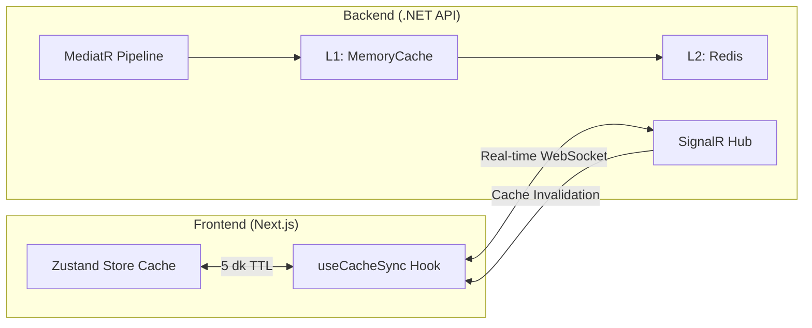
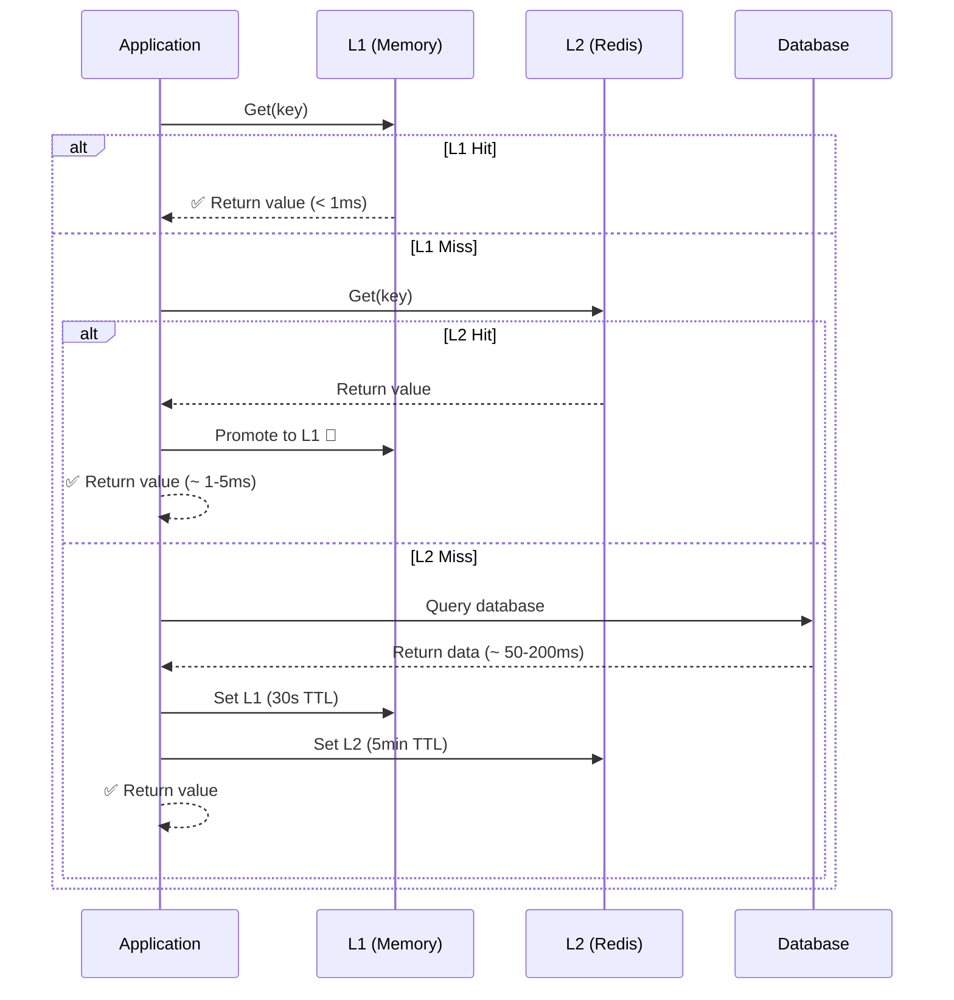
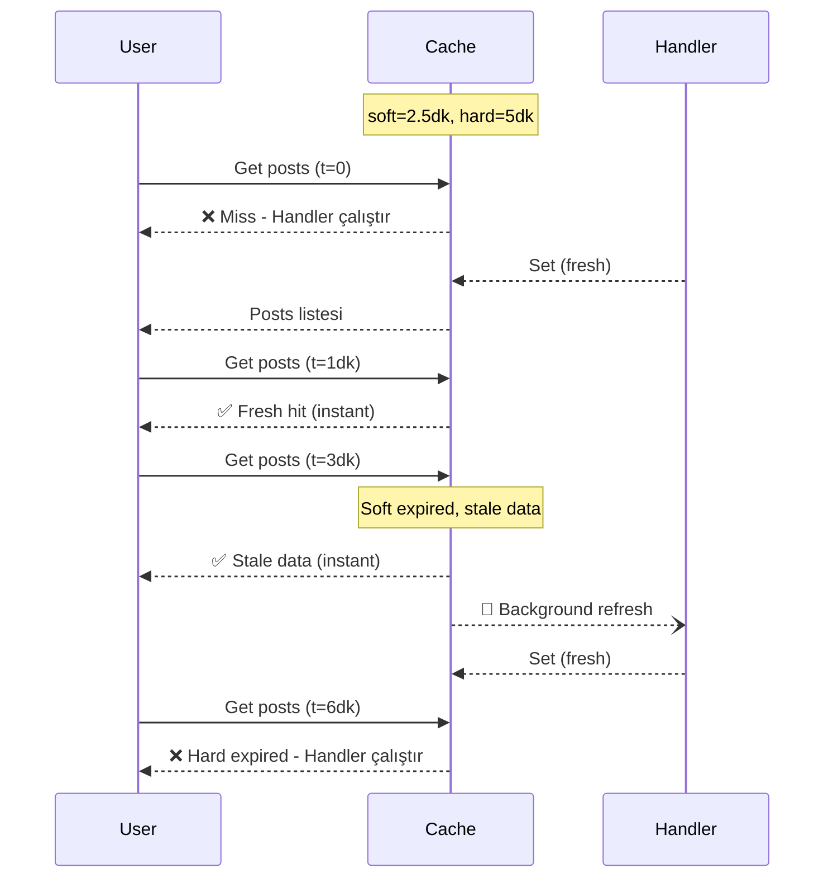

# Cache Mekanizması - Detaylı Teknik Rapor

Bu rapor, BlogApp projesindeki Cache (önbellekleme) sisteminin detaylı teknik analizi ve çalışma prensiplerini açıklamaktadır.

---

## Genel Bakış

Projede **3 katmanlı hibrit cache mimarisi** kullanılmaktadır:



| Katman | Teknoloji | TTL | Amaç |
|--------|-----------|-----|------|
| **Frontend Cache** | Zustand Store | 5 dakika | İstemci tarafı önbellek |
| **L1 (Backend)** | IMemoryCache | 30 saniye | Ultra hızlı, ağ yok |
| **L2 (Backend)** | Redis | 5 dakika | Instance'lar arası paylaşım |

---

## Backend Cache Mimarisi

### 1. Hibrit L1/L2 Cache Service

```csharp
// BlogApp.Server.Infrastructure/Services/CacheService.cs
public class CacheService : ICacheService, IDisposable
{
    private readonly IMemoryCache _l1Cache;          // L1: Ultra hızlı, in-memory
    private readonly IDistributedCache _l2Cache;     // L2: Redis/Distributed
    private readonly IConnectionMultiplexer? _redis; // Redis SCAN desteği
    private readonly CacheMetrics _metrics;          // Observability
    private readonly ICacheInvalidationNotifier? _notifier; // Frontend bildirim

    // L1: 30 saniye (kısa - instance tutarlılığı için)
    private static readonly TimeSpan L1DefaultExpiration = TimeSpan.FromSeconds(30);
    
    // L2: 5 dakika (uzun - shared cache)
    private static readonly TimeSpan L2DefaultExpiration = TimeSpan.FromMinutes(5);
}
```

### 2. Cache Okuma Akışı



### 3. Cache Stampede Koruması

Aynı key için birden fazla istek geldiğinde veritabanına çarpma problemini önler:

```csharp
public async Task<T> GetOrSetAsync<T>(string key, Func<Task<T>> factory, ...)
{
    // 1. İlk kontrol - L1 (kilitsiz)
    if (_l1Cache.TryGetValue(key, out T? l1Value))
        return l1Value!;
    
    // 2. L2 kontrolü
    var cached = await GetFromL2Async<T>(key, ...);
    if (cached is not null) return cached;
    
    // 3. Key-bazlı kilit al
    var keyLock = _locks.GetOrAdd(key, _ => new SemaphoreSlim(1, 1));
    await keyLock.WaitAsync(LockTimeout);
    
    try
    {
        // 4. Double-check pattern (kilit sonrası)
        if (_l1Cache.TryGetValue(key, out l1Value))
        {
            _metrics.RecordStampedePrevented(keyPrefix);
            return l1Value!;
        }
        
        // 5. Factory execute et ve cache'le
        var value = await factory();
        await SetAsync(key, value, expiration);
        return value;
    }
    finally { keyLock.Release(); }
}
```

---

## MediatR Caching Pipeline

Otomatik caching için MediatR behavior pattern'i:

### ICacheableQuery Interface

```csharp
// Request'lerin cache'lenebilir olduğunu belirtir
public interface ICacheableQuery
{
    string CacheKey { get; }           // Benzersiz cache key
    string? CacheGroup { get; }        // Grup bazlı invalidation için
    TimeSpan? CacheDuration { get; }   // Cache süresi
    bool UseStaleWhileRevalidate => false; // SWR pattern
    double SwrSoftRatio => 0.5;        // Soft expiration oranı
}
```

### Kullanım Örneği

```csharp
public record GetPostsListQueryRequest : IRequest<GetPostsListQueryResponse>, ICacheableQuery
{
    public int PageNumber { get; init; }
    public int PageSize { get; init; }
    public string? Status { get; init; }
    
    // Cache configuration
    public string CacheKey => $"posts:page{PageNumber}:size{PageSize}:status{Status}";
    public string CacheGroup => "posts_list";
    public TimeSpan? CacheDuration => TimeSpan.FromMinutes(5);
    public bool UseStaleWhileRevalidate => true;  // SWR enabled
    public double SwrSoftRatio => 0.5;            // 2.5 dk soft, 5 dk hard
}
```

---

## Stale-While-Revalidate (SWR) Pattern

Kullanıcı deneyimini iyileştirmek için "eski veriyi hemen göster, arka planda tazele" stratejisi:



### SWR Implementasyonu

```csharp
public async Task<T> GetOrSetWithSwrAsync<T>(
    string key, Func<Task<T>> factory,
    TimeSpan softExpiration, TimeSpan? hardExpiration = null, ...)
{
    var result = await GetWithMetadataAsync<T>(key);
    
    if (result.IsHit)
    {
        if (result.IsStale)
        {
            // Stale veri döndür, arka planda tazele
            _ = Task.Run(async () =>
            {
                var freshValue = await factory();
                await SetWithSoftExpirationAsync(key, freshValue, ...);
            });
        }
        return result.Value!;  // Anında yanıt
    }
    
    // Cache miss - factory çalıştır
    var value = await factory();
    await SetWithSoftExpirationAsync(key, value, softExpiration, hardExpiration);
    return value;
}
```

---

## Cache Invalidation Stratejileri

### 1. Group Versioning

Aynı kategorideki tüm cache'leri tek seferde geçersiz kıl:

```csharp
// Post oluşturulduğunda
public async Task Handle(CreatePostCommandRequest request, ...)
{
    // ... post oluştur ...
    
    // Tüm posts listesi cache'lerini geçersiz kıl
    await cacheService.RotateGroupVersionAsync("posts_list");
}
```

**Nasıl Çalışır:**
- Cache key: `posts_list:v1:posts:page1:size10:status=Published`
- Version rotate sonrası: `posts_list:v2:...` olur
- Eski v1 key'leri artık match etmez, expire olana kadar orphaned kalır

### 2. Prefix-Based Invalidation

```csharp
// Belirli bir post'un tüm cache'lerini temizle
await cacheService.RemoveByPrefixAsync($"post:{postId}");
```

### 3. SignalR Real-Time Notification

Frontend'e cache invalidation bildirimi:

```csharp
// Backend - CacheService.cs
if (_notifier != null)
{
    _ = _notifier.NotifyGroupInvalidatedAsync(groupName, CancellationToken.None);
}
```

---

## Frontend Cache Mimarisi

### 1. Zustand Store Cache

```typescript
// blogapp-web/src/stores/posts-store.ts
const CACHE_DURATION = 5 * 60 * 1000; // 5 dakika

interface CacheEntry<T> {
  data: T;
  timestamp: number;
}

interface PostsState {
  cache: { [key: string]: CacheEntry<PaginatedResult<BlogPost>> };
  postCache: { [slug: string]: CacheEntry<BlogPost> };
  cacheVersion: number;  // Invalidation trigger
  
  fetchPosts: (params?, forceRefresh?) => Promise<void>;
  invalidateCache: () => void;
}
```

### 2. Cache Key Generation

```typescript
const getCacheKey = (params?: Record<string, unknown>): string => {
  if (!params) return 'default';
  // Tutarlı key için parametreleri sırala
  return JSON.stringify(params, Object.keys(params).sort());
};
```

### 3. Cache Validity Check

```typescript
const isCacheValid = <T>(entry: CacheEntry<T> | undefined): boolean => {
  if (!entry) return false;
  return Date.now() - entry.timestamp < CACHE_DURATION;
};
```

### 4. Data Fetch with Cache

```typescript
fetchPosts: async (params, forceRefresh = false) => {
  const cacheKey = getCacheKey(params);
  const cachedEntry = get().cache[cacheKey];

  // Valid cache varsa döndür
  if (!forceRefresh && isCacheValid(cachedEntry)) {
    set({ posts: cachedEntry.data, isLoading: false });
    return;
  }

  // API'den çek ve cache'le
  const response = await postsApi.getAll(params);
  if (response.success) {
    set({
      posts: response.data,
      cache: {
        ...get().cache,
        [cacheKey]: { data: response.data, timestamp: Date.now() }
      }
    });
  }
}
```

---

## Real-Time Cache Sync (SignalR)

### useCacheSync Hook

```typescript
// blogapp-web/src/hooks/use-cache-sync.ts
export function useCacheSync(options: UseCacheSyncOptions) {
  const connection = new signalR.HubConnectionBuilder()
    .withUrl('/hubs/cache', { withCredentials: true })
    .withAutomaticReconnect()
    .build();

  // Backend'den cache invalidation event'i al
  connection.on('CacheInvalidated', (event: CacheInvalidationEvent) => {
    console.log('Cache invalidated:', event);
    onInvalidate(event);
  });

  // Belirli gruplara subscribe ol
  await connection.invoke('SubscribeToGroup', 'posts_list');
}
```

### useAutoCacheSync (Basit Kullanım)

```typescript
// Component'te kullanım
export function useAutoCacheSync(invalidateCache: () => void) {
  return useCacheSync({
    onInvalidate: (event) => {
      console.log('Cache invalidated, refreshing...');
      invalidateCache();  // Zustand store cache'i temizle
    }
  });
}
```

---

## Cache Metrics & Observability

```csharp
public sealed class CacheMetrics : IDisposable
{
    // Hit/Miss oranları
    public void RecordL1Hit(string prefix) { ... }
    public void RecordL2Hit(string prefix) { ... }
    public void RecordL1Miss(string prefix) { ... }
    public void RecordL2Miss(string prefix) { ... }
    
    // SWR metrikleri  
    public void RecordSwrFreshHit(string prefix) { ... }
    public void RecordSwrStaleHit(string prefix) { ... }
    
    // Performans
    public void RecordStampedePrevented(string prefix) { ... }
    public void RecordLockTimeout(string prefix) { ... }
    
    // Sayaçlar
    public void UpdateL1KeysCount(int count) { ... }
    public void UpdateActiveLocksCount(int count) { ... }
}
```

---

## Özet

| Özellik | Backend | Frontend |
|---------|---------|----------|
| **Cache Türü** | L1/L2 Hybrid | In-Memory Store |
| **Teknoloji** | MemoryCache + Redis | Zustand |
| **TTL** | L1: 30s, L2: 5min | 5 dakika |
| **Stampede Koruması** | ✅ Key-based locking | ❌ (gereksiz) |
| **SWR Pattern** | ✅ Tam destek | ❌ |
| **Group Versioning** | ✅ Atomic INCR | ✅ cacheVersion |
| **Real-time Sync** | ✅ SignalR Hub | ✅ useCacheSync |
| **Metrics** | ✅ OpenTelemetry | ❌ |

### Güçlü Yönler

- 🚀 **3 katmanlı cache** ile maksimum performans
- 🔒 **Stampede protection** ile veritabanı koruması
- ⚡ **SWR pattern** ile anlık kullanıcı yanıtı
- 🔄 **Real-time sync** ile frontend-backend tutarlılığı
- 📊 **Metrics** ile gözlemlenebilirlik
