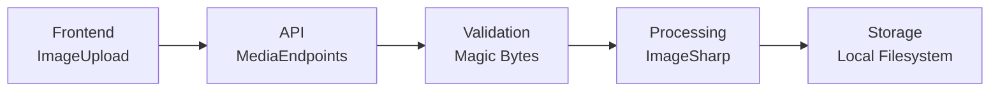
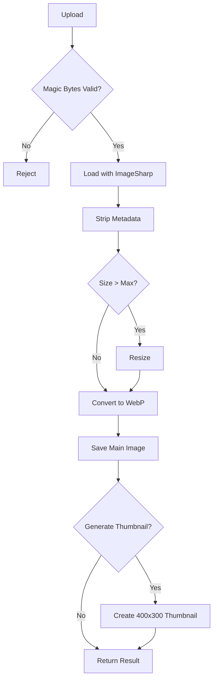

# File Upload Mekanizması Teknik Raporu

**Tarih:** 3 Ocak 2026  
**Proje:** BlogApp

---

## Özet

BlogApp, güvenli ve optimize edilmiş bir dosya yükleme sistemi sunmaktadır. Sistem şu bileşenlerden oluşur:



---

## 1. API Endpoints

**Dosya:** [MediaEndpoints.cs](file:///d:/MrBekoXBlogApp/src/BlogApp.Server/BlogApp.Server.Api/Endpoints/MediaEndpoints.cs)

| Endpoint | Method | Açıklama |
|----------|--------|----------|
| `/api/v1/media/upload/image` | POST | Tek görsel yükleme |
| `/api/v1/media/upload/images` | POST | Çoklu görsel yükleme (max 10) |
| `/api/v1/media` | DELETE | Dosya silme |

### Kısıtlamalar

```csharp
AllowedImageTypes = { "image/jpeg", "image/png", "image/gif", "image/webp" }
MaxFileSize = 10 * 1024 * 1024  // 10MB
```

### Yetkilendirme

```csharp
.RequireAuthorization(policy => policy.RequireRole("Admin", "Editor", "Author"))
```

---

## 2. Güvenlik Katmanları

### 2.1 Magic Bytes Doğrulama

**Dosya:** [FileValidationHelper.cs](file:///d:/MrBekoXBlogApp/src/BlogApp.Server/BlogApp.Server.Infrastructure/Services/Helpers/FileValidationHelper.cs)

Dosyanın gerçek formatını doğrulamak için ilk bytes kontrol edilir:

| Format | Magic Bytes |
|--------|-------------|
| JPEG | `FF D8 FF` |
| PNG | `89 50 4E 47 0D 0A 1A 0A` |
| GIF | `47 49 46 38 37/39 61` |
| WebP | `52 49 46 46` + offset 8'de `57 45 42 50` |

```csharp
// Sahte dosya tespiti
if (!ValidateMagicBytes(fileBytes, claimedContentType))
    return FileValidationResult.Invalid("Magic bytes validation failed");
```

### 2.2 Dosya Adı Sanitizasyonu

```csharp
// Path traversal koruması
var sanitized = Path.GetFileName(fileName);
var invalidChars = Path.GetInvalidFileNameChars();
sanitized = string.Join("_", sanitized.Split(invalidChars));
```

### 2.3 Path Traversal Koruması

**Dosya:** [FileStorageService.cs](file:///d:/MrBekoXBlogApp/src/BlogApp.Server/BlogApp.Server.Infrastructure/Services/FileStorageService.cs)

```csharp
// Silme işleminde path traversal kontrolü
var fullPath = Path.GetFullPath(filePath);
var uploadsFullPath = Path.GetFullPath(_uploadsFolder);

if (!fullPath.StartsWith(uploadsFullPath))
{
    logger.LogWarning("Path traversal attempt detected");
    return false;
}
```

### 2.4 Metadata Temizleme

```csharp
// EXIF ve diğer metadata güvenlik için temizlenir
image.Metadata.ExifProfile = null;
image.Metadata.XmpProfile = null;
image.Metadata.IccProfile = null;
image.Metadata.IptcProfile = null;
```

---

## 3. Görsel İşleme Pipeline

**Kütüphane:** SixLabors.ImageSharp

### 3.1 İşleme Seçenekleri

```csharp
public class ImageUploadOptions
{
    public int MaxWidth { get; set; } = 1920;
    public int MaxHeight { get; set; } = 1080;
    public int Quality { get; set; } = 85;
    public bool ConvertToWebP { get; set; } = true;
    public bool GenerateThumbnail { get; set; } = true;
    public int ThumbnailWidth { get; set; } = 400;
    public int ThumbnailHeight { get; set; } = 300;
}
```

### 3.2 İşleme Akışı



### 3.3 Dosya Depolama Yapısı

```
uploads/
├── images/
│   ├── {basename}_{uuid}.webp        # Ana görsel
│   └── {basename}_{uuid}_thumb.webp  # Thumbnail
```

---

## 4. Frontend Entegrasyonu

### 4.1 API Client

**Dosya:** [api.ts](file:///d:/MrBekoXBlogApp/src/blogapp-web/src/lib/api.ts)

```typescript
export const mediaApi = {
  uploadImage: async (file: File, generateThumbnail = true) => {
    const formData = new FormData();
    formData.append('file', file);
    return apiClient.post(`/media/upload/image?generateThumbnail=${generateThumbnail}`, formData);
  },
  
  uploadImages: async (files: File[]) => {
    const formData = new FormData();
    files.forEach(file => formData.append('files', file));
    return apiClient.post('/media/upload/images', formData);
  }
};
```

### 4.2 ImageUpload Component

**Dosya:** [image-upload.tsx](file:///d:/MrBekoXBlogApp/src/blogapp-web/src/components/image-upload.tsx)

**Özellikler:**
- Drag & drop desteği
- File input ile seçim
- Progress göstergesi
- Preview görüntüleme
- Error handling

---

## 5. Rate Limiting

```json
{
  "GeneralRules": [
    {
      "Endpoint": "post:/api/*/media/upload/image",
      "Period": "1m",
      "Limit": 10
    },
    {
      "Endpoint": "post:/api/*/media/upload/images",
      "Period": "5m",
      "Limit": 5
    }
  ]
}
```

---

## 6. Sonuç

| Özellik | Durum |
|---------|-------|
| Magic Bytes Validation | ✅ |
| Path Traversal Protection | ✅ |
| Filename Sanitization | ✅ |
| EXIF/Metadata Stripping | ✅ |
| WebP Conversion | ✅ |
| Thumbnail Generation | ✅ |
| Rate Limiting | ✅ |
| Role-based Authorization | ✅ |

File Upload mekanizması, OWASP güvenlik standartlarına uygun, modern ve optimize edilmiş bir yapıdadır.
