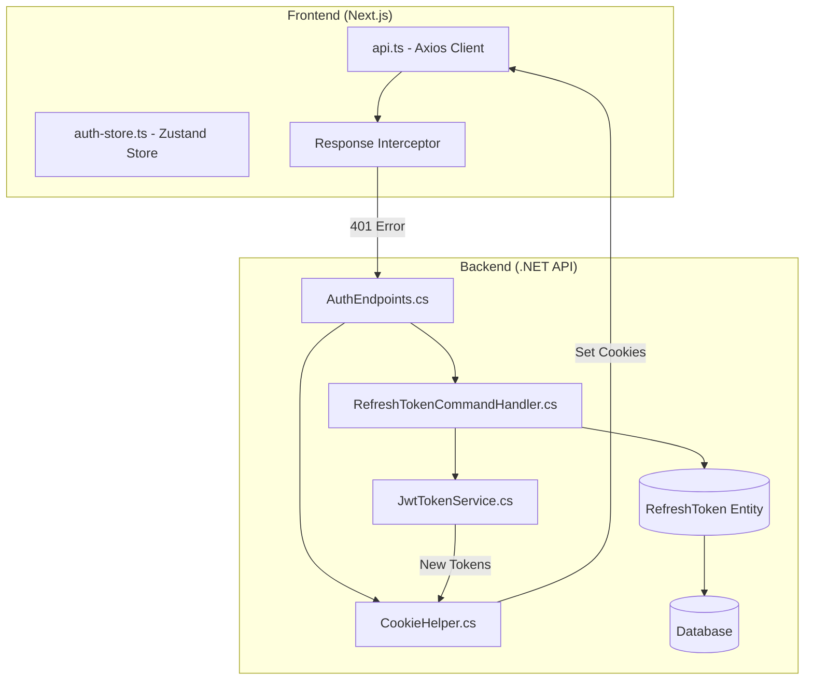
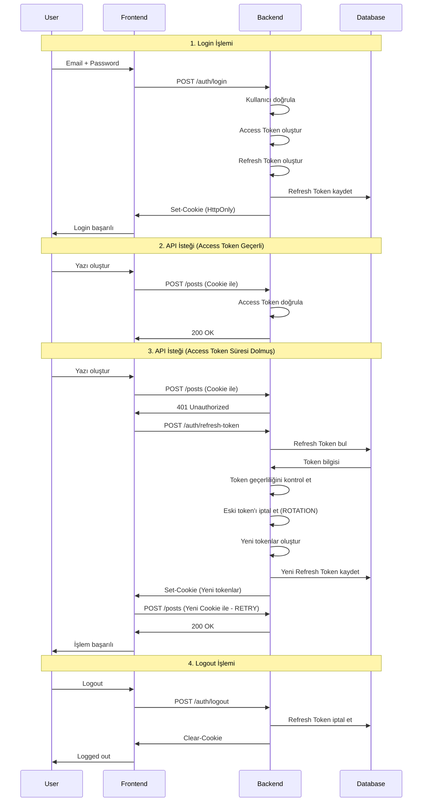

# Refresh Token Mekanizması - Detaylı Teknik Rapor

Bu rapor, BlogApp projesindeki Refresh Token mekanizmasının detaylı teknik analizi ve çalışma prensiplerini açıklamaktadır.

---

## Genel Bakış

Projede **JWT (JSON Web Token)** tabanlı kimlik doğrulama sistemi kullanılmaktadır. Bu sistem iki ana token tipinden oluşur:

| Token Türü | Ömür | Depolama | Amaç |
|------------|------|----------|------|
| **Access Token** | ~15-60 dakika | HttpOnly Cookie | API isteklerini yetkilendirmek |
| **Refresh Token** | 7 gün | HttpOnly Cookie + Database | Access Token yenilemek |

---

## Mimari Bileşenler



---

## Backend Implementasyonu

### 1. RefreshToken Entity

Veritabanında refresh token'ları saklamak için kullanılan domain entity:

```csharp
// BlogApp.Server.Domain/Entities/RefreshToken.cs
public class RefreshToken : BaseEntity
{
    public string Token { get; set; }              // Kriptografik token değeri
    public DateTime ExpiresAt { get; set; }        // Son kullanma tarihi (7 gün)
    public DateTime CreatedAt { get; set; }        // Oluşturulma tarihi
    public string? CreatedByIp { get; set; }       // Oluşturan IP adresi
    public DateTime? RevokedAt { get; set; }       // İptal tarihi
    public string? RevokedByIp { get; set; }       // İptal eden IP adresi
    public string? ReplacedByToken { get; set; }   // Yerine geçen token (rotation)
    public string? ReasonRevoked { get; set; }     // İptal sebebi
    
    // Computed properties
    public bool IsExpired => DateTime.UtcNow >= ExpiresAt;
    public bool IsRevoked => RevokedAt != null;
    public bool IsActive => !IsRevoked && !IsExpired;
}
```

> [!IMPORTANT]
> **Token Rotation**: Her refresh işleminde eski token iptal edilir ve yerine yeni token oluşturulur. Bu, token çalınması durumunda güvenliği artırır.

---

### 2. JWT Token Service

Kriptografik token üretimi için kullanılan servis:

```csharp
// BlogApp.Server.Infrastructure/Services/JwtTokenService.cs
public class JwtTokenService : IJwtTokenService
{
    // Access Token üretimi
    public string GenerateAccessToken(User user)
    {
        var claims = new List<Claim>
        {
            new(JwtRegisteredClaimNames.Sub, user.Id.ToString()),
            new(JwtRegisteredClaimNames.Email, user.Email),
            new(JwtRegisteredClaimNames.Jti, Guid.NewGuid().ToString()),
            new(ClaimTypes.Name, user.UserName),
            new(ClaimTypes.Role, user.Role.ToString()),
            new("userId", user.Id.ToString())
        };
        
        var token = new JwtSecurityToken(
            issuer: _settings.Issuer,
            audience: _settings.Audience,
            claims: claims,
            expires: DateTime.UtcNow.AddMinutes(_settings.ExpirationMinutes),
            signingCredentials: credentials
        );
        
        return new JwtSecurityTokenHandler().WriteToken(token);
    }
    
    // Refresh Token üretimi (kriptografik random)
    public string GenerateRefreshToken()
    {
        var randomNumber = new byte[64];
        using var rng = RandomNumberGenerator.Create();
        rng.GetBytes(randomNumber);
        return Convert.ToBase64String(randomNumber);
    }
}
```

---

### 3. Refresh Token Command Handler

Token yenileme iş mantığı (CQRS pattern):

```csharp
// RefreshTokenCommandHandler.cs
public async Task<RefreshTokenCommandResponse> Handle(
    RefreshTokenCommandRequest request, 
    CancellationToken cancellationToken)
{
    // 1. Veritabanından refresh token'ı bul
    var storedToken = await unitOfWork.RefreshTokensRead.Query()
        .Include(t => t.User)
        .FirstOrDefaultAsync(t => t.Token == dto.RefreshToken);
    
    // 2. Token geçerlilik kontrolleri
    if (storedToken is null)
        return Failure("Invalid refresh token");
        
    if (!storedToken.IsActive)
        return Failure("Refresh token expired");
    
    // 3. Kullanıcı kontrolü
    var user = storedToken.User;
    if (user is null || !user.IsActive || user.IsDeleted)
        return Failure("User not found");
    
    // 4. TOKEN ROTATION: Eski token'ı iptal et
    storedToken.RevokedAt = DateTime.UtcNow;
    storedToken.RevokedByIp = dto.IpAddress;
    storedToken.ReasonRevoked = "Replaced by new token";
    
    // 5. Yeni tokenlar oluştur
    var newAccessToken = jwtTokenService.GenerateAccessToken(user);
    var newRefreshToken = jwtTokenService.GenerateRefreshToken();
    
    storedToken.ReplacedByToken = newRefreshToken;
    
    // 6. Yeni refresh token'ı veritabanına kaydet
    var refreshTokenEntity = new RefreshToken
    {
        Token = newRefreshToken,
        UserId = user.Id,
        ExpiresAt = DateTime.UtcNow.AddDays(7),
        CreatedAt = DateTime.UtcNow,
        CreatedByIp = dto.IpAddress
    };
    
    await unitOfWork.RefreshTokensWrite.AddAsync(refreshTokenEntity);
    await unitOfWork.SaveChangesAsync();
    
    return Success(newAccessToken, newRefreshToken);
}
```

---

### 4. Cookie Helper

HttpOnly cookie yönetimi:

```csharp
// BlogApp.Server.Api/Helpers/CookieHelper.cs
public static void SetAuthCookies(
    HttpResponse response,
    string accessToken,
    string refreshToken,
    DateTime accessTokenExpiry,
    bool isProduction)
{
    // Access Token Cookie
    var accessCookieOptions = new CookieOptions
    {
        HttpOnly = true,              // JavaScript erişimi engellenir (XSS koruması)
        Secure = isProduction,        // HTTPS zorunluluğu (production'da)
        SameSite = SameSiteMode.Strict,// CSRF koruması
        Path = "/api",                // Sadece API isteklerinde gönderilir
        Expires = accessTokenExpiry,
        IsEssential = true
    };
    
    // Refresh Token Cookie (daha kısıtlı path)
    var refreshCookieOptions = new CookieOptions
    {
        HttpOnly = true,
        Secure = isProduction,
        SameSite = SameSiteMode.Strict,
        Path = "/api/auth",           // Sadece auth endpoint'lerinde gönderilir
        Expires = DateTime.UtcNow.AddDays(7),
        IsEssential = true
    };
    
    response.Cookies.Append("BlogApp.AccessToken", accessToken, accessCookieOptions);
    response.Cookies.Append("BlogApp.RefreshToken", refreshToken, refreshCookieOptions);
}
```

> [!NOTE]
> **Güvenlik Özellikleri:**
> - `HttpOnly`: XSS saldırılarına karşı koruma
> - `Secure`: HTTPS zorunluluğu
> - `SameSite=Strict`: CSRF saldırılarına karşı koruma
> - Farklı `Path` değerleri: Minimum yetki prensibi

---

### 5. Auth Endpoints

API endpoint tanımları:

```csharp
// POST /api/v1/auth/refresh-token
group.MapPost("/refresh-token", async (
    IMediator mediator,
    HttpContext context,
    IWebHostEnvironment environment) =>
{
    // 1. Cookie'den refresh token'ı oku
    var refreshToken = context.Request.Cookies["BlogApp.RefreshToken"];
    
    if (string.IsNullOrEmpty(refreshToken))
    {
        CookieHelper.ClearAuthCookies(context.Response, isProduction);
        return Results.BadRequest("Refresh token not found");
    }
    
    // 2. Token yenileme işlemini gerçekleştir
    var response = await mediator.Send(new RefreshTokenCommandRequest
    {
        RefreshTokenCommandRequestDto = new RefreshTokenCommandDto
        {
            RefreshToken = refreshToken,
            IpAddress = CookieHelper.GetIpAddress(context)
        }
    });
    
    // 3. Yeni cookie'leri set et
    if (response.Result.IsSuccess)
    {
        CookieHelper.SetAuthCookies(
            context.Response,
            response.Result.Value.AccessToken,
            response.Result.Value.RefreshToken,
            response.Result.Value.ExpiresAt,
            isProduction);
    }
    
    return Results.Ok(response);
});
```

---

## Frontend Implementasyonu

### 1. Axios Response Interceptor

Otomatik token yenileme mantığı:

```typescript
// blogapp-web/src/lib/api.ts
export const apiClient = axios.create({
  baseURL: API_BASE_URL,
  withCredentials: true, // Cookie'lerin otomatik gönderilmesi için zorunlu
});

// Response interceptor - 401 hatalarında otomatik refresh
apiClient.interceptors.response.use(
  (response) => response,
  async (error: AxiosError) => {
    const originalRequest = error.config as InternalAxiosRequestConfig & { _retry?: boolean };

    // Sadece 401 hatalarında ve auth endpoint'leri dışında refresh dene
    if (
      error.response?.status === 401 &&
      originalRequest &&
      !originalRequest._retry &&
      !originalRequest.url?.includes('/auth/login') &&
      !originalRequest.url?.includes('/auth/register')
    ) {
      originalRequest._retry = true;

      try {
        // Refresh token endpoint'i çağır (cookie otomatik gönderilir)
        const response = await apiClient.post('/auth/refresh-token');

        if (response.data.success) {
          // Yeni cookie'ler sunucu tarafından otomatik set edilir
          // Orijinal isteği tekrar dene
          return apiClient(originalRequest);
        }
      } catch {
        // Refresh başarısız - login sayfasına yönlendir
        if (typeof window !== 'undefined') {
          window.location.href = '/login';
        }
      }
    }

    return Promise.reject(error);
  }
);
```

---

## Token Flow Diyagramı



---

## Güvenlik Özellikleri

| Özellik | Açıklama | Koruma |
|---------|----------|--------|
| **HttpOnly Cookies** | Token'lar JavaScript'ten erişilemez | XSS saldırıları |
| **Secure Flag** | Cookie'ler sadece HTTPS üzerinden gönderilir | Man-in-the-middle |
| **SameSite=Strict** | Cookie'ler sadece aynı origin'den istek yapılırsa gönderilir | CSRF saldırıları |
| **Token Rotation** | Her refresh'te yeni token oluşturulur, eski iptal edilir | Token theft |
| **IP Tracking** | Token oluşturma ve iptal IP'leri loglanır | Audit & Detection |
| **Short-lived Access Token** | Access token kısa ömürlü | Token compromise |
| **Path Restriction** | Refresh token sadece `/api/auth` path'inde gönderilir | Minimum exposure |

---

## Özet

Bu proje, modern ve güvenli bir JWT refresh token mekanizması implementasyonu sunmaktadır:

- ✅ **HttpOnly Cookie tabanlı** - Token'lar client-side JavaScript'ten korunur
- ✅ **Token Rotation** - Her refresh'te yeni token oluşturulur
- ✅ **CQRS Pattern** - Clean Architecture uyumlu handler yapısı
- ✅ **Database Persistence** - Refresh token'lar veritabanında saklanır
- ✅ **IP Tracking** - Güvenlik denetimi için IP loglaması
- ✅ **Automatic Retry** - Frontend 401 hatalarında otomatik refresh ve retry
- ✅ **Graceful Logout** - Token iptali ve cookie temizliği
