# BlogApp Sistem İstek Yönlendirme Mimarisi

Bu doküman, BlogApp projesinin istek yönlendirme mekanizmasını uçtan uca açıklar. İki ana kısımdan oluşmaktadır:

1. **Yüksek Seviye (Genel Bakış)** - Hızlı kavrayış için yüksek seviyeli mimari
2. **Detaylı (Teknik Derinlik)** - Teknik implementasyon detayları

---

# BÖLÜM 1: YÜKSEK SEVİYE (GENEL BAKIŞ)

## Sistem Genel Bakış

BlogApp, **3-tier mimari** ile yapılandırılmış modern bir blog uygulamasıdır:

```
┌─────────────────────────────────────────────────────────────────┐
│                         Kullanıcı                                │
└──────────────────────────────┬──────────────────────────────────┘
                               │
                               ▼
┌─────────────────────────────────────────────────────────────────┐
│  Frontend (Next.js)          │  Backend (ASP.NET Core)          │
│  - Port: 3000                │  - Port: 8080                    │
│  - SSR/CSR                   │  - JWT + Cookie Auth             │
│  - App Router                │  - CQRS Pattern                  │
└──────────────────────────────┴──────────────────────────────────┘
                               │
                               ▼
┌─────────────────────────────────────────────────────────────────┐
│  Veri Katmanı                                                  │
│  - PostgreSQL (Port: 5432)    │  - Redis (Port: 6379)            │
│  - Blog verileri              │  - Cache & Sessions             │
└──────────────────────────────┴──────────────────────────────────┘
```

## Temel Bileşenler

### 1. Frontend (blogapp-web)
- **Next.js 15** ile App Router
- **Port:** 3000 (development), 3000 (production docker)
- **Görev:** Kullanıcı arayüzü, SSR, SEO optimizasyonu
- **Önemli:** Public routes (`/posts`, `/login`, `/register`) ve Protected routes (`/mrbekox-console/dashboard/*`)

### 2. Backend (BlogApp.Server.Api)
- **ASP.NET Core** Minimal API
- **Port:** 5116 HTTP, 7254 HTTPS (development), 8080 (production)
- **Görev:** API endpoints, authentication, business logic
- **Pattern:** Clean Architecture + CQRS

### 3. Reverse Proxy (Production)
- **nginx** tüm trafiği yönlendirir
- **Port:** 80 (public)
- **Görev:** Load balancing, SSL termination, static asset serving

---

# ÖRNEK SENARYOLAR - YÜKSEK SEVİYE AKIŞ

## Senaryo 1: Blog Postu Görüntüleme (Anonim Kullanıcı)

**Senaryo:** Ziyaretçi tarayıcıda `/posts/my-first-blog-post` URL'ine girer

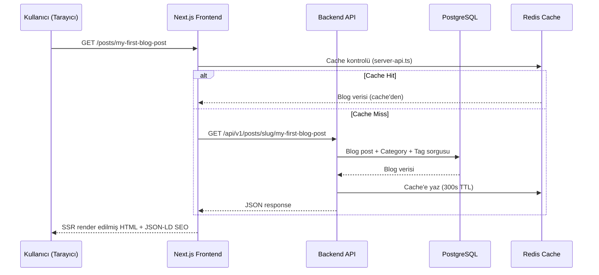

**Önemli Noktalar:**
- ✅ **Authentication gerekmez** - Public route
- ✅ **SSR** - SEO için server-side render
- ✅ **Cache** - Redis 5 dakika cache
- ✅ **SEO** - JSON-LD structured data

---

## Senaryo 2: Kullanıcı Girişi (Login)

**Senaryo:** Kullanıcı `/login` sayfasında email ve password girer

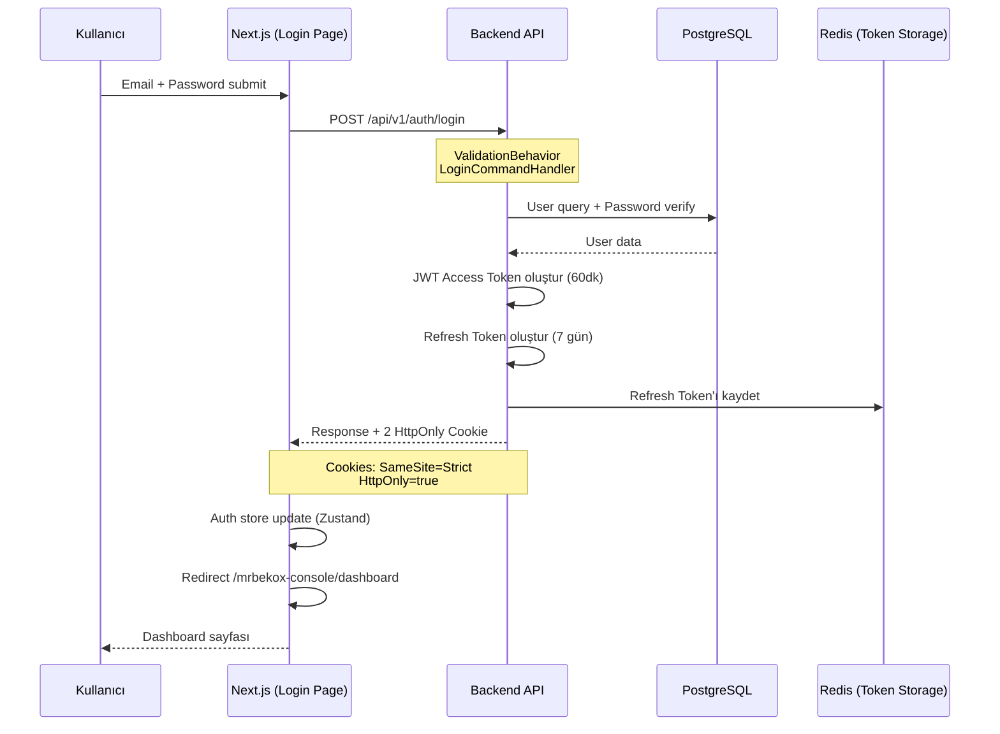

**Önemli Noktalar:**
- ✅ **HttpOnly Cookies** - XSS koruması
- ✅ **SameSite=Strict** - CSRF koruması
- ✅ **Double Token System** - Access (60dk) + Refresh (7 gün)
- ✅ **Zustand Persistence** - Client state management

---

## Senaryo 3: Admin Panel Erişimi

**Senaryo:** Admin kullanıcı `/mrbekox-console/dashboard` sayfasına erişmek ister

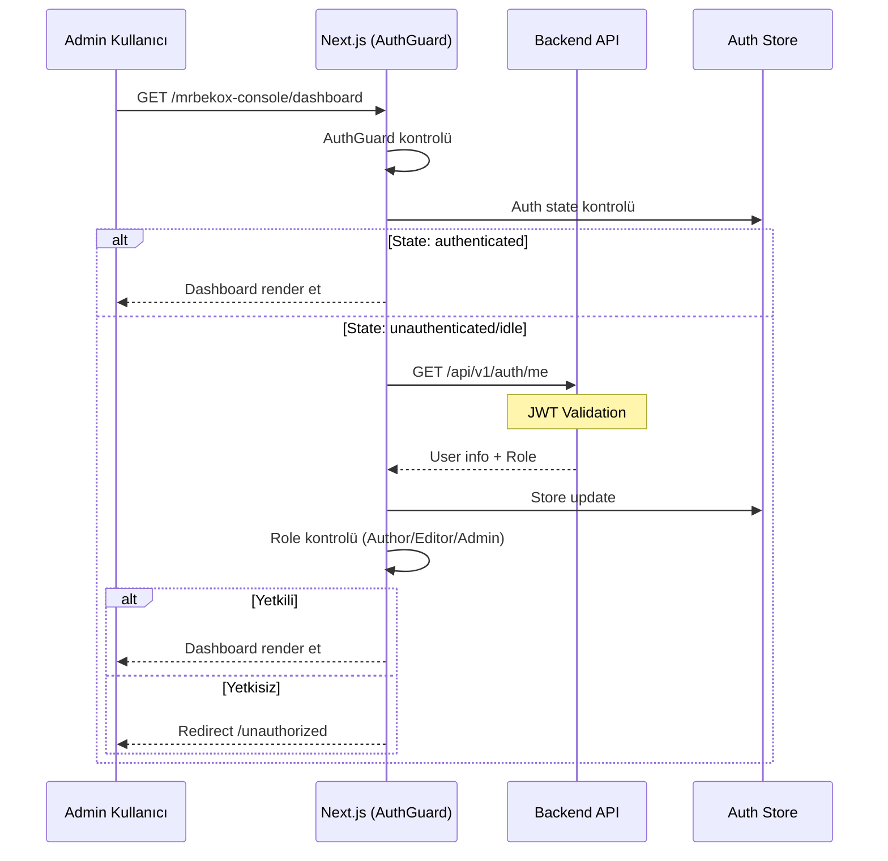

**Önemli Noktalar:**
- ✅ **AuthGuard** - Route protection middleware
- ✅ **Role-Based Access** - Author/Editor/Admin
- ✅ **Auto Refresh** - 401'de token refresh
- ✅ **Infinite Loop Prevention** - Refresh cooldown

---

## Senaryo 4: Blog Postu Oluşturma

**Senaryo:** Admin kullanıcı yeni blog postu oluşturur

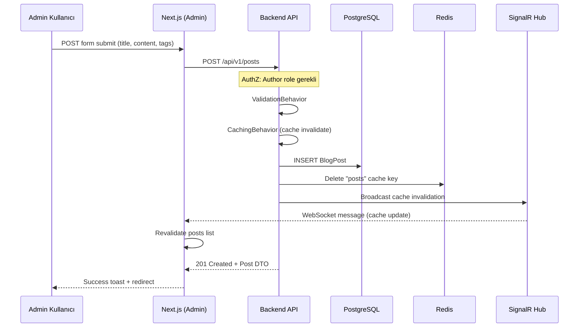

**Önemli Noktalar:**
- ✅ **Authorization** - Role check
- ✅ **Cache Invalidation** - Redis delete + SignalR broadcast
- ✅ **CQRS** - Command pattern
- ✅ **Real-time Update** - WebSocket notification

---

# GENEL İSTEK YÖNLENDİRME MİMARİSİ

## Development Ortamı

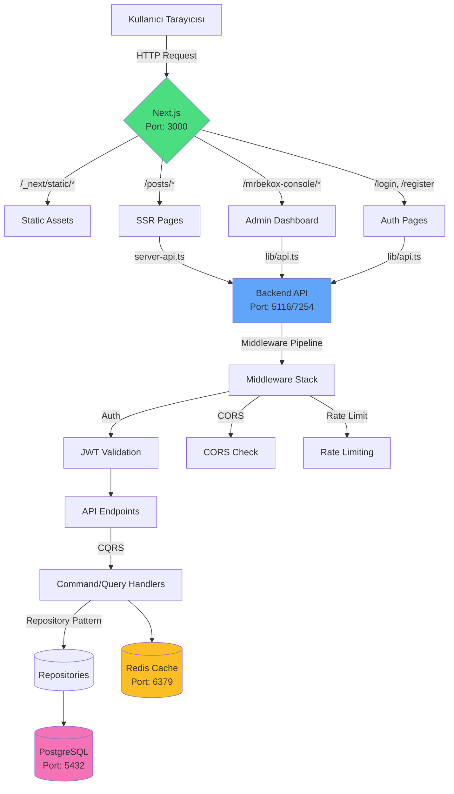

## İstek Yönlendirme Kuralları

### Frontend Routing (Next.js App Router)

| URL Pattern | Component | Auth Gerekli? | SSR? |
|-------------|-----------|---------------|-----|
| `/` | Home page | ❌ | ✅ |
| `/posts` | Posts list | ❌ | ✅ |
| `/posts/[slug]` | Post detail | ❌ | ✅ |
| `/login` | Login page | ❌ (redirect if auth) | ❌ |
| `/register` | Register page | ❌ (redirect if auth) | ❌ |
| `/mrbekox-console` | Admin login | ❌ (redirect if auth) | ❌ |
| `/mrbekox-console/dashboard/*` | Admin dashboard | ✅ (Author+) | ❌ |

### Backend API Routing

| URL Pattern | Handler | Auth Gerekli? | Cache? |
|-------------|---------|---------------|--------|
| `GET /api/v1/posts` | GetPostsListQuery | ❌ | ✅ (60s) |
| `GET /api/v1/posts/{slug}` | GetPostBySlugQuery | ❌ | ✅ (300s) |
| `POST /api/v1/auth/login` | LoginCommand | ❌ | ❌ |
| `POST /api/v1/auth/refresh` | RefreshTokenCommand | ❌ | ❌ |
| `GET /api/v1/auth/me` | GetCurrentUser | ✅ | ❌ |
| `POST /api/v1/posts` | CreatePostCommand | ✅ (Author+) | ❌ |
| `PUT /api/v1/posts/{id}` | UpdatePostCommand | ✅ (Author+) | ❌ |
| `DELETE /api/v1/posts/{id}` | DeletePostCommand | ✅ (Author+) | ❌ |

---

# BÖLÜM 2: DETAYLI (TEKNİK DERİNLİK)

## 1. FRONTEND ARCHITECTURE - DETAYLİ

### 1.1 Next.js Konfigürasyonu (`next.config.ts`)

```typescript
// next.config.ts
const nextConfig = {
  output: 'standalone',        // Docker için optimize
  trailingSlash: false,        // Clean URLs
  experimental: {
    optimizeCss: true,         // CSS optimizasyonu
  },
  images: {
    remotePatterns: [
      { protocol: 'https', hostname: 'mrbekox.dev' },
      { protocol: 'http', hostname: 'localhost:5116' },
    ],
  },
}
```

### 1.2 API Client Mimarisi

#### Client-Side API (`lib/api.ts`)

```typescript
// Axios instance configuration
const apiClient = axios.create({
  baseURL: process.env.NEXT_PUBLIC_API_URL || 'http://localhost:5116',
  withCredentials: true,  // HttpOnly cookies için
  headers: {
    'Content-Type': 'application/json',
  },
})

// Response interceptor - Auto token refresh
apiClient.interceptors.response.use(
  (response) => response,
  async (error) => {
    if (error.response?.status === 401 && !error.config._retry) {
      error.config._retry = true
      try {
        await authApi.refreshToken()
        return apiClient.request(error.config)
      } catch (refreshError) {
        authStore.logout()
        window.location.href = '/login'
      }
    }
    return Promise.reject(error)
  }
)
```

#### Server-Side API (`lib/server-api.ts`)

```typescript
// Next.js native fetch with caching
export async function getPostsList(params: GetPostsListQueryRequest) {
  const baseUrl = process.env.API_URL || 'http://localhost:5116'
  const url = new URL(`${baseUrl}/api/v1/posts`)

  // Build query parameters
  Object.entries(params).forEach(([key, value]) => {
    if (value !== undefined) {
      url.searchParams.append(key, String(value))
    }
  })

  // Next.js caching with revalidation
  return fetch(url.toString(), {
    next: { revalidate: 60 }, // 60 seconds ISR
    headers: {
      'Content-Type': 'application/json',
    },
  }).then(res => res.json())
}
```

### 1.3 Authentication Flow - Detaylı

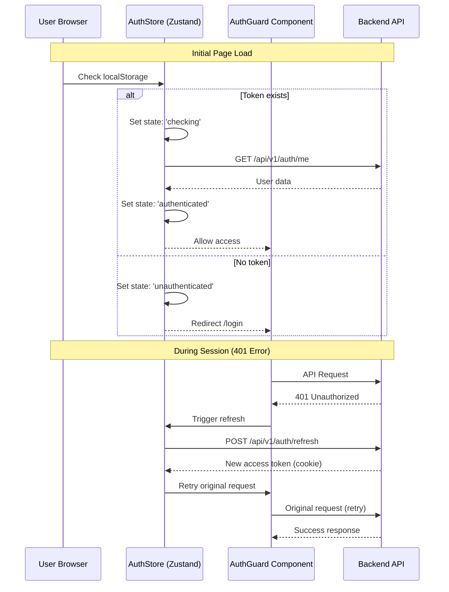

**AuthStore Persistence:**
```typescript
// src/stores/auth-store.ts
interface AuthState {
  status: 'idle' | 'checking' | 'authenticated' | 'unauthenticated'
  user: User | null
}

// Persist to localStorage
export const useAuthStore = create<AuthState>()(
  persist(
    (set) => ({
      status: 'idle',
      user: null,
      login: async (credentials) => { ... },
      logout: () => {
        localStorage.removeItem('auth-storage')
        window.location.href = '/login'
      },
    }),
    { name: 'auth-storage' }
  )
)
```

### 1.4 Route Protection - AuthGuard

```typescript
// src/components/auth/auth-guard.tsx
export function AuthGuard({
  children,
  requiredRoles,
}: {
  children: React.ReactNode
  requiredRoles?: UserRole[]
}) {
  const { status, user, checkAuth } = useAuthStore()
  const router = useRouter()

  useEffect(() => {
    if (status === 'idle') {
      checkAuth() // Trigger /me endpoint
    }
  }, [status, checkAuth])

  if (status === 'checking' || status === 'idle') {
    return <LoadingSkeleton />
  }

  if (status === 'unauthenticated') {
    router.push('/login')
    return null
  }

  if (requiredRoles && !requiredRoles.includes(user!.role)) {
    router.push('/unauthorized')
    return null
  }

  return <>{children}</>
}
```

---

## 2. BACKEND ARCHITECTURE - DETAYLI

### 2.1 Middleware Pipeline (Program.cs)

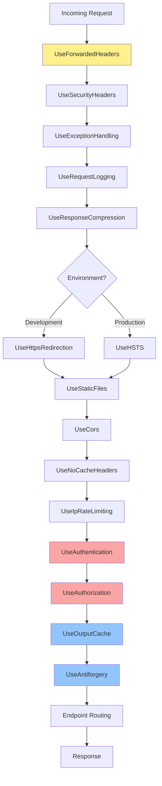

### 2.2 Endpoint Registration Pattern

**Centralized Registration:**
```csharp
// RegisterEndpointsExtensions.cs
public static void RegisterAllEndpoints(this IEndpointRouteBuilder app)
{
    var api = app.NewVersionedApi();

    api.MapAuthEndpoints(app);
    api.MapPostsEndpoints(app);
    api.MapCategoriesEndpoints(app);
    api.MapTagsEndpoints(app);
    api.MapMediaEndpoints(app);
    api.MapCsrfEndpoints(app);
    api.MapSeoEndpoints(app);
}
```

**Example: Posts Endpoints**
```csharp
// PostsEndpoints.cs
public static void MapPostsEndpoints(this IVersionedEndpointRouteBuilder api)
{
    var group = api.MapGroup("/api/v{version:apiVersion}/posts")
        .WithTags("Posts")
        .WithOpenApi()
        .CacheOutput(x => x.Tag("posts"));

    // Public endpoints
    group.MapGet("/", GetPostsListEndpoint.Handle)
        .AllowAnonymous()
        .CacheOutput(x => x.Expire(TimeSpan.FromSeconds(60)));

    group.MapGet("/slug/{slug}", GetPostBySlugEndpoint.Handle)
        .AllowAnonymous()
        .CacheOutput(x => x.Expire(TimeSpan.FromSeconds(300)));

    // Protected endpoints
    group.MapPost("/", CreatePostEndpoint.Handle)
        .RequireAuthorization("AuthorPolicy");

    group.MapPut("/{id}", UpdatePostEndpoint.Handle)
        .RequireAuthorization("AuthorPolicy");
}
```

### 2.3 CQRS Pipeline - Request Flow

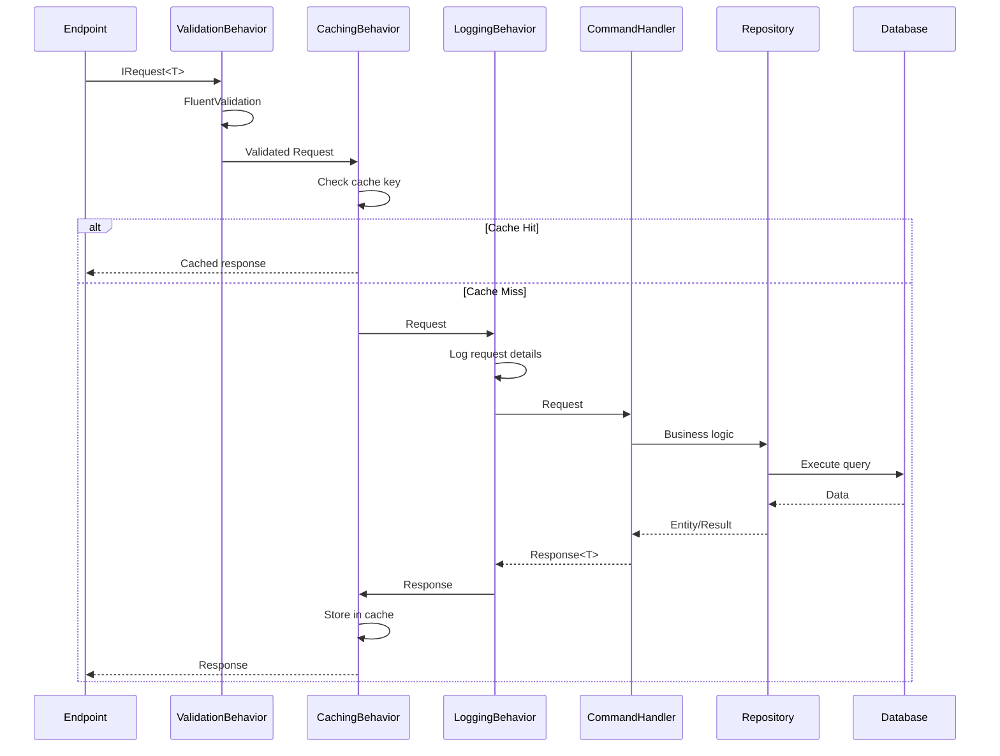

**Behavior Pipeline Configuration:**
```csharp
// DependencyInjection.cs - Application Layer
services.AddValidatorsFromAssembly(Assembly.GetExecutingAssembly());

services.AddMediatR(cfg => {
    cfg.RegisterServicesFromAssembly(Assembly.GetExecutingAssembly());
});

// Pipeline behaviors
services.AddTransient(
    typeof(IPipelineBehavior<,>),
    typeof(ValidationBehavior<,>)
);
services.AddTransient(
    typeof(IPipelineBehavior<,>),
    typeof(CachingBehavior<,>)
);
services.AddTransient(
    typeof(IPipelineBehavior<,>),
    typeof(LoggingBehavior<,>)
);
```

### 2.4 Authentication - JWT + Cookie Implementation

**JWT Configuration:**
```csharp
// JwtTokenService.cs
public class JwtTokenService : IJwtTokenService
{
    public string GenerateAccessToken(User user)
    {
        var claims = new[]
        {
            new Claim(ClaimTypes.NameIdentifier, user.Id.ToString()),
            new Claim(ClaimTypes.Email, user.Email.Value),
            new Claim(ClaimTypes.Role, user.Role.ToString()),
            new Claim("ip_address", _currentUserService.GetIpAddress())
        };

        var key = new SymmetricSecurityKey(Encoding.UTF8.GetBytes(_jwtSettings.Secret));
        var creds = new SigningCredentials(key, SecurityAlgorithms.HmacSha256);

        var token = new JwtSecurityToken(
            issuer: _jwtSettings.Issuer,
            audience: _jwtSettings.Audience,
            claims: claims,
            expires: DateTime.UtcNow.AddMinutes(_jwtSettings.AccessTokenExpirationMinutes),
            signingCredentials: creds
        );

        return new JwtSecurityTokenHandler().WriteToken(token);
    }

    public string GenerateRefreshToken()
    {
        return Guid.NewGuid().ToString() + "-" + Guid.NewGuid().ToString();
    }
}
```

**Cookie Configuration:**
```csharp
// LoginCommandHandler.cs
var accessToken = _jwtTokenService.GenerateAccessToken(user);
var refreshToken = _jwtTokenService.GenerateRefreshToken();

// Save refresh token to database
var refreshTokenEntity = new RefreshToken
{
    Token = refreshToken,
    UserId = user.Id,
    ExpiresAt = DateTime.UtcNow.AddDays(7),
    CreatedAt = DateTime.UtcNow,
    CreatedByIp = _currentUserService.GetIpAddress()
};
await _refreshTokenWriteRepository.AddAsync(refreshTokenEntity);

// Set cookies
HttpContext.Response.Cookies.Append("BlogApp.AccessToken", accessToken, new CookieOptions
{
    HttpOnly = true,
    Secure = _environment.IsProduction(),
    SameSite = SameSiteMode.Strict,
    Expires = DateTimeOffset.UtcNow.AddMinutes(60)
});

HttpContext.Response.Cookies.Append("BlogApp.RefreshToken", refreshToken, new CookieOptions
{
    HttpOnly = true,
    Secure = _environment.IsProduction(),
    SameSite = SameSiteMode.Strict,
    Expires = DateTimeOffset.UtcNow.AddDays(7),
    Path = "/api/v1/auth/refresh-token" // Restrict to refresh endpoint
});
```

### 2.5 Cache Invalidation Strategy

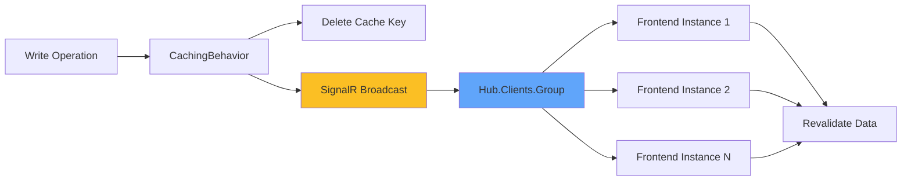

**CacheInvalidationNotifier:**
```csharp
// CacheInvalidationNotifier.cs
public class CacheInvalidationNotifier : ICacheInvalidationNotifier
{
    private readonly IHubContext<CacheInvalidationHub> _hubContext;

    public async Task InvalidateAsync(string cacheKey)
    {
        // Delete from Redis
        await _cacheService.RemoveAsync(cacheKey);

        // Broadcast to all connected clients
        await _hubContext.Clients.Group(cacheKey)
            .SendAsync("CacheInvalidated", new { cacheKey, timestamp = DateTime.UtcNow });
    }
}

// Usage in Command Handler
public async Task<CreatePostCommandResponse> Handle(CreatePostCommandRequest request, ...)
{
    var post = await _blogPostWriteRepository.AddAsync(blogPost);
    await _unitOfWork.SaveChangesAsync();

    // Invalidate cache
    await _cacheInvalidationNotifier.InvalidateAsync(PostCacheKeys.List);
    await _cacheInvalidationNotifier.InvalidateAsync(PostCacheKeys.Featured);

    return new CreatePostCommandResponse { Id = post.Id };
}
```

### 2.6 Rate Limiting Implementation

```csharp
// Program.cs
builder.Services.AddRateLimiter(options => {
    options.AddPolicy("IpRateLimit", context =>
        RateLimitPartition.GetSlidingWindowLimiter(
            partitionKey: context.Connection.RemoteIpAddress?.ToString(),
            factory: _ => new SlidingWindowRateLimiterOptions
            {
                PermitLimit = 100,
                Window = TimeSpan.FromSeconds(10),
                SegmentsPerWindow = 10,
                ProcessingPermitLimit = 10
            }
        )
    );
});

app.UseRateLimiter();
```

---

## 3. DEPLOYMENT ARCHITECTURE - DETAYLI

### 3.1 Production Docker Compose Structure

```yaml
# docker-compose.prod.yml
services:
  postgres:
    image: postgres:16-alpine
    ports:
      - "5432:5432"
    environment:
      - POSTGRES_USER=${POSTGRES_USER}
      - POSTGRES_PASSWORD=${POSTGRES_PASSWORD}
      - POSTGRES_DB=${POSTGRES_DB}
    volumes:
      - postgres_data:/var/lib/postgresql/data
    healthcheck:
      test: ["CMD-SHELL", "pg_isready -U ${POSTGRES_USER}"]
      interval: 10s
      timeout: 5s
      retries: 5

  redis:
    image: redis:7-alpine
    command: redis-server --maxmemory 32mb --maxmemory-policy allkeys-lru --requirepass ${REDIS_PASSWORD}
    ports:
      - "6379:6379"
    volumes:
      - redis_data:/data
    healthcheck:
      test: ["CMD", "redis-cli", "--raw", "incr", "ping"]
      interval: 10s
      timeout: 3s
      retries: 5

  api:
    image: mrbeko/blog-app:api-latest
    ports:
      - "8080:8080"
    environment:
      - ASPNETCORE_ENVIRONMENT=Production
      - ASPNETCORE_URLS=http://+:8080
      - ConnectionStrings__DefaultConnection=Host=postgres;Port=5432;Database=${POSTGRES_DB};Username=${POSTGRES_USER};Password=${POSTGRES_PASSWORD}
      - Redis__ConnectionString=localhost:6379,password=${REDIS_PASSWORD}
    depends_on:
      postgres:
        condition: service_healthy
      redis:
        condition: service_healthy
    volumes:
      - ./uploads:/app/uploads

  frontend:
    image: mrbeko/blog-app:web-latest
    ports:
      - "3000:3000"
    environment:
      - NEXT_PUBLIC_API_URL=https://mrbekox.dev/api/v1
      - NEXT_PUBLIC_SITE_URL=https://mrbekox.dev
    depends_on:
      - api

  nginx:
    image: nginx:alpine
    ports:
      - "80:80"
      - "443:443"
    volumes:
      - ./nginx.conf:/etc/nginx/nginx.conf:ro
      - ./certbot/conf:/etc/letsencrypt:ro
      - ./certbot/www:/var/www/certbot:ro
    depends_on:
      - api
      - frontend

networks:
  default:
    name: blogapp-network
```

### 3.2 nginx Configuration - Production

```nginx
# nginx.conf
upstream frontend {
    server frontend:3000;
    keepalive 8;
}

upstream api {
    server api:8080;
    keepalive 16;
}

# Redirect www to non-www
server {
    listen 80;
    server_name www.mrbekox.dev;
    return 301 https://mrbekox.dev$request_uri;
}

# Main server
server {
    listen 80;
    server_name mrbekox.dev;

    # Security headers
    add_header X-Frame-Options "DENY" always;
    add_header X-Content-Type-Options "nosniff" always;
    add_header X-XSS-Protection "1; mode=block" always;
    add_header Referrer-Policy "strict-origin-when-cross-origin" always;
    add_header Permissions-Policy "geolocation=(), microphone=(), camera=()" always;
    add_header Content-Security-Policy "default-src 'self'; script-src 'self' 'unsafe-inline' 'unsafe-eval'; style-src 'self' 'unsafe-inline'; img-src 'self' data: https:; font-src 'self' data:;" always;
    add_header Strict-Transport-Security "max-age=31536000; includeSubDomains" always;

    # Health check endpoint
    location /health {
        proxy_pass http://api/health;
        proxy_http_version 1.1;
        proxy_set_header Connection "";
        proxy_set_header X-Real-IP $remote_addr;
        proxy_set_header X-Forwarded-For $proxy_add_x_forwarded_for;
        proxy_set_header X-Forwarded-Proto $scheme;
    }

    # Media upload endpoint (20MB limit)
    location ~ ^/api/v[0-9]+/media/upload {
        client_max_body_size 20M;
        proxy_pass http://api;
        proxy_http_version 1.1;
        proxy_set_header Connection "";
        proxy_set_header X-Real-IP $remote_addr;
        proxy_set_header X-Forwarded-For $proxy_add_x_forwarded_for;
        proxy_set_header X-Forwarded-Proto $scheme;
    }

    # API endpoints
    location /api {
        proxy_pass http://api;
        proxy_http_version 1.1;
        proxy_set_header Connection "";
        proxy_set_header X-Real-IP $remote_addr;
        proxy_set_header X-Forwarded-For $proxy_add_x_forwarded_for;
        proxy_set_header X-Forwarded-Proto $scheme;
        client_max_body_size 1M;
    }

    # WebSocket/SignalR support
    location /hubs/ {
        proxy_pass http://api;
        proxy_http_version 1.1;
        proxy_set_header Upgrade $http_upgrade;
        proxy_set_header Connection "upgrade";
        proxy_set_header X-Real-IP $remote_addr;
        proxy_set_header X-Forwarded-For $proxy_add_x_forwarded_for;
        proxy_set_header X-Forwarded-Proto $scheme;
        proxy_read_timeout 86400s;
        proxy_send_timeout 86400s;
        proxy_connect_timeout 75s;
    }

    # Next.js static assets (long cache)
    location /_next/static/ {
        proxy_pass http://frontend;
        add_header Cache-Control "public, max-age=31536000, immutable";
        proxy_hide_header Link;
    }

    # All other traffic to frontend
    location / {
        proxy_pass http://frontend;
        proxy_http_version 1.1;
        proxy_set_header Connection "";
        proxy_set_header X-Real-IP $remote_addr;
        proxy_set_header X-Forwarded-For $proxy_add_x_forwarded_for;
        proxy_set_header X-Forwarded-Proto $scheme;
    }
}
```

### 3.3 Production Request Flow - Detaylı

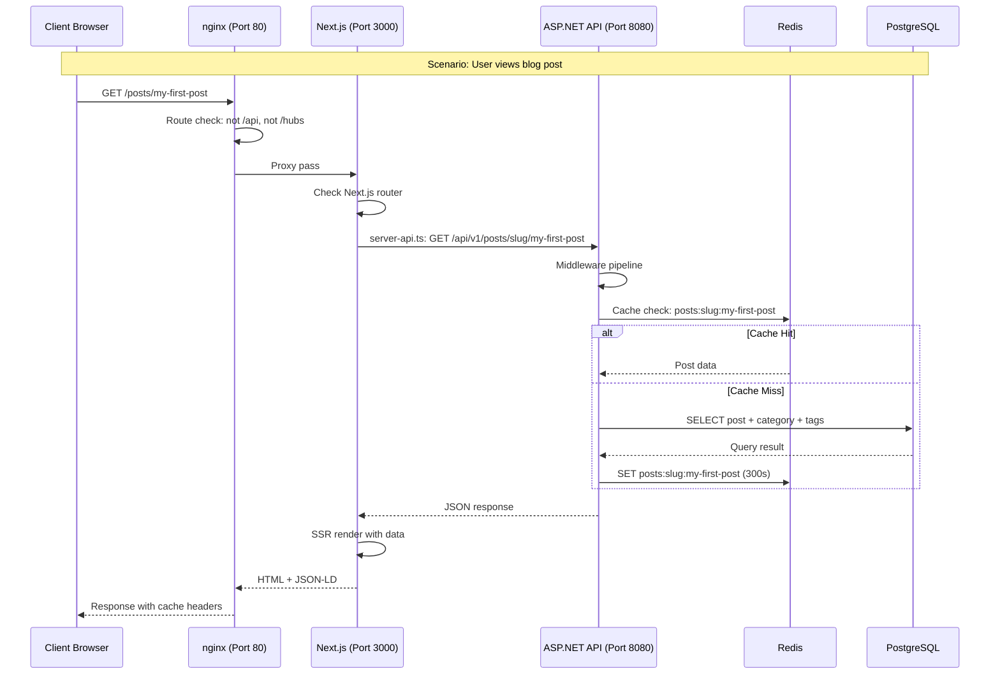

---

## 4. PERFORMANS OPTİMİZASYONLARI

### 4.1 Frontend Optimizasyonları

| Optimizasyon | Teknik | Etki |
|--------------|--------|------|
| **Image Optimization** | Next.js Image + WebP conversion | %40-60 daha küçük dosyalar |
| **Code Splitting** | Automatic route-based splitting | Hızlı initial load |
| **CSS Optimization** | `optimizeCss: true` | Daha az CSS payload |
| **Font Optimization** | Next.js font optimization | Prevent FOUT/FoIT |
| **ISR Caching** | 60-300s revalidation | Daha az API çağrısı |

### 4.2 Backend Optimizasyonları

| Optimizasyon | Teknik | Etki |
|--------------|--------|------|
| **Output Caching** | `[OutputCache]` attribute | %80-90 cache hit rate |
| **Response Compression** | Gzip/Brotli | %70-80 daha küçük response |
| **Connection Pooling** | Npgsql connection pooling | Daha az DB connection |
| **Compiled Queries** | EF Core compiled queries | Daha hızlı sorgular |
| **Rate Limiting** | Sliding window | DDoS koruması |

### 4.3 Cache Strategy

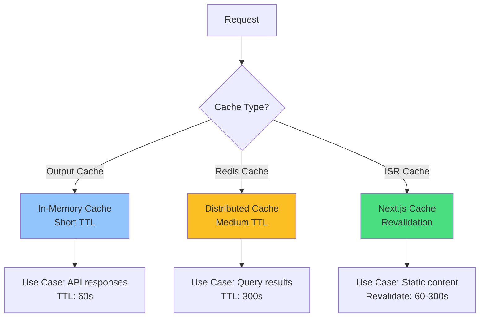

---

## 5. GÜVENLİK ÖNLEMLERİ

### 5.1 Authentication Security

| Önlem | Implementasyon | Amaç |
|-------|----------------|------|
| **HttpOnly Cookies** | `HttpOnly=true` | XSS koruması |
| **SameSite=Strict** | `SameSiteMode.Strict` | CSRF koruması |
| **Secure Flag** | `Secure=true` (production) | HTTPS only |
| **Short Access Token** | 60 dakika | Token leak etkisini sınırla |
| **IP Address Tracking** | Token'da IP sakla | Token theft detection |
| **Refresh Token Rotation** | Her refresh'te yeni token | Replay attack koruması |

### 5.2 API Security

| Önlem | Implementasyon | Amaç |
|-------|----------------|------|
| **Rate Limiting** | 100 req/10s per IP | DDoS koruması |
| **CORS** | Strict origin policy | Cross-origin koruması |
| **CSRF Tokens** | `[Antiforgery]` | CSRF koruması |
| **Input Validation** | FluentValidation | Injection koruması |
| **Role-Based Access** | `[Authorize(Roles="Author")]` | Yetkilendirme |
| **Request Logging** | Her request logla | Audit trail |

### 5.3 Security Headers

```
X-Frame-Options: DENY
X-Content-Type-Options: nosniff
X-XSS-Protection: 1; mode=block
Referrer-Policy: strict-origin-when-cross-origin
Permissions-Policy: geolocation=(), microphone=(), camera=()
Content-Security-Policy: default-src 'self'; ...
Strict-Transport-Security: max-age=31536000; includeSubDomains
```

---

## 6. TROUBLESHOOTING GUIDE

### 6.1 Yaygın Sorunlar ve Çözümler

| Sorun | Olası Neden | Çözüm |
|-------|-------------|-------|
| **401 Unauthorized** | Expired access token | Trigger token refresh |
| **Infinite 401 loop** | Refresh token expired | Clear localStorage, redirect /login |
| **CORS error** | Origin mismatch | Check `AllowedHosts` configuration |
| **Cache stale data** | Cache not invalidated | Check SignalR connection |
| **WebSocket failed** | nginx WebSocket config | Check `/hubs/` location block |
| **Rate limit exceeded** | Too many requests | Implement exponential backoff |
| **Upload failed** | File size > limit | Check nginx `client_max_body_size` |

---

## 7. KAYNAKLAR

### İlgili Dosyalar

**Backend:**
- `src/BlogApp.Server/BlogApp.Server.Api/Program.cs` - Middleware pipeline
- `src/BlogApp.Server/BlogApp.Server.Api/Endpoints/` - API endpoints
- `src/BlogApp.Server/BlogApp.Server.Application/Features/` - CQRS handlers
- `src/BlogApp.Server/BlogApp.Server.Infrastructure/Services/JwtTokenService.cs` - JWT implementation

**Frontend:**
- `src/blogapp-web/next.config.ts` - Next.js configuration
- `src/blogapp-web/src/lib/api.ts` - Client-side API client
- `src/blogapp-web/src/lib/server-api.ts` - Server-side API client
- `src/blogapp-web/src/stores/auth-store.ts` - Authentication state
- `src/blogapp-web/src/components/auth/auth-guard.tsx` - Route protection

**Deployment:**
- `deploy/nginx.conf` - nginx reverse proxy configuration
- `deploy/docker-compose.prod.yml` - Production containers
- `deploy/env.template` - Environment variables

---

## ÖZET

Bu doküman, BlogApp projesinin istek yönlendirme mimarisini iki seviyede detaylandırmaktadır:

**Yüksek Seviye (Bölüm 1):**
- Sistem genel bakışı
- 4 örnek senaryo (blog görüntüleme, login, admin panel, post oluşturma)
- Genel istek yönlendirme diyagramları
- Routing tabloları

**Detaylı (Bölüm 2):**
- Frontend architecture (Next.js, API client, authentication)
- Backend architecture (middleware, CQRS, JWT, caching)
- Deployment architecture (Docker, nginx, production flow)
- Performans optimizasyonları
- Güvenlik önlemleri
- Troubleshooting guide

Bu mimari, **modern web standartlarına** uygun, **güvenli**, **ölçeklenebilir** ve **performanslı** bir blog uygulaması sağlar.

---

*Doküman Versiyonu: 1.0*
*Son Güncelleme: 2026-01-14*
*Yazar: Claude (Anthropic)*
