# MrBekoX Blog Uygulamasi - Istek Yonlendirme Mimarisi

Bu dokuman, MrBekoX Blog uygulamasinin nginx tabanli istek yonlendirme mekanizmasini ve uçtan uca istek akislarini detayli olarak açiklamaktadir.

---

## Icerik

1. [Genel Sistem Mimarisi](#1-genel-sistem-mimarisi)
2. [Servis Yapisi ve Portlar](#2-servis-yapisi-ve-portlar)
3. [Nginx Istek Yonlendirme Mekanizmasi](#3-nginx-istek-yonlendirme-mekanizmasi)
4. [Ornek Senaryo 1: Blog Yazisi Goruntuleme](#4-ornek-senaryo-1-blog-yazisi-goruntuleme)
5. [Ornek Senaryo 2: Yeni Blog Yazisi Olusturma](#5-ornek-senaryo-2-yeni-blog-yazisi-olusturma)
6. [Ornek Senaryo 3: Arama Islemi](#6-ornek-senaryo-3-arama-islemi)
7. [Genel Istek Yonlendirme Diyagrami](#7-genel-istek-yonlendirme-diyagrami)
8. [Guvenlik Mekanizmalari](#8-guvenlik-mekanizmalari)
9. [Cache Stratejisi](#9-cache-stratejisi)

---

## 1. Genel Sistem Mimarisi

Sistem, modern bir microservices mimarisi kullanmaktadir. Tum istekler AWS ALB (Application Load Balancer) uzerinden HTTPS ile alinir, Nginx reverse proxy tarafindan yonlendirilir ve ilgili servislere iletilir.

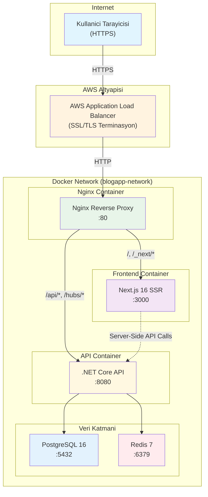

### Mimari Bilesenler

| Bilesen | Teknoloji | Port | Gorev |
|---------|-----------|------|-------|
| **ALB** | AWS Application Load Balancer | 443 (HTTPS) | SSL terminasyon, yuk dengeleme |
| **Nginx** | nginx:alpine | 80 | Reverse proxy, routing, guvenlik |
| **Frontend** | Next.js 16 + React 19 | 3000 | SSR/SSG, kullanici arayuzu |
| **API** | .NET Core 10 | 8080 | REST API, is mantigi |
| **PostgreSQL** | PostgreSQL 16 Alpine | 5432 | Ana veritabani |
| **Redis** | Redis 7 Alpine | 6379 | Cache, session, real-time |

---

## 2. Servis Yapisi ve Portlar

### Docker Network Yapisi

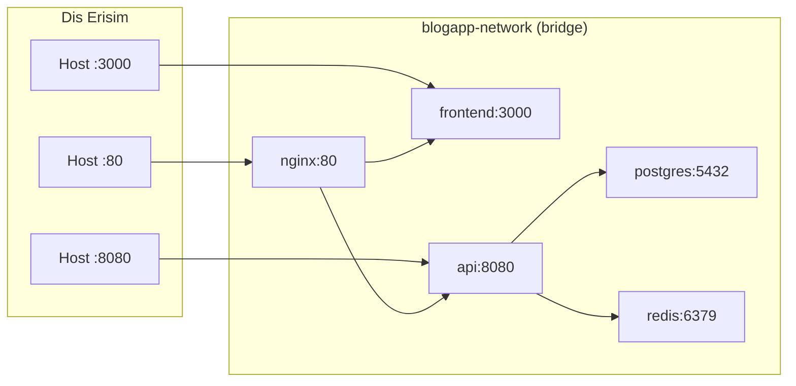

### Container Detaylari

| Container | Image | Memory Limit | Health Check |
|-----------|-------|--------------|--------------|
| blogapp-nginx-prod | nginx:alpine | 32MB | - |
| blogapp-frontend-prod | mrbeko/blog-app:web-latest | 64MB | - |
| blogapp-api-prod | mrbeko/blog-app:api-latest | 300MB | - |
| blogapp-postgres-prod | postgres:16-alpine | 128MB | pg_isready |
| blogapp-redis-prod | redis:7-alpine | 64MB | redis-cli ping |

---

## 3. Nginx Istek Yonlendirme Mekanizmasi

Nginx, tum gelen istekleri URL pattern'ine gore uygun backend servisine yonlendirir.

### Routing Kurallari (Oncelik Sirasina Gore)

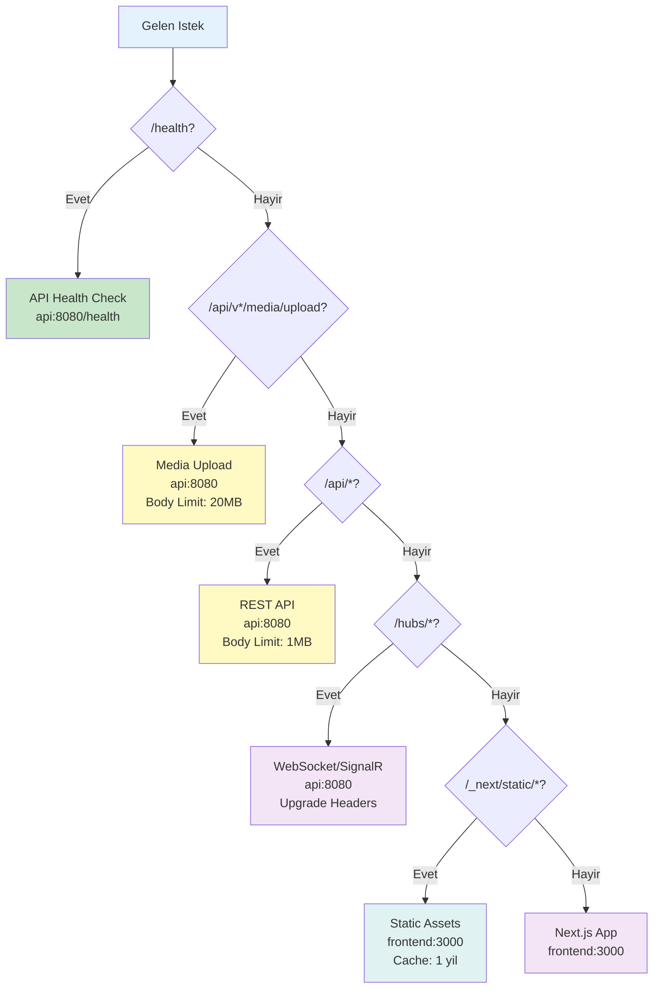

### Upstream Tanimlari

```nginx
# Frontend Upstream (Next.js)
upstream frontend {
    server frontend:3000;
    keepalive 8;
}

# API Upstream (.NET Core)
upstream api {
    server api:8080;
    keepalive 16;
}
```

### Routing Detaylari

| Pattern | Hedef | Body Limit | Ozel Ayarlar |
|---------|-------|------------|--------------|
| `/health` | api:8080 | 1MB | Logging kapali |
| `/api/v[0-9]+/media/upload` | api:8080 | 20MB | Dosya yukleme |
| `/api/*` | api:8080 | 1MB | REST API |
| `/hubs/*` | api:8080 | 1MB | WebSocket, 24s timeout |
| `/_next/static/*` | frontend:3000 | 1MB | 1 yil cache |
| `/` | frontend:3000 | 1MB | Catch-all |

---

## 4. Ornek Senaryo 1: Blog Yazisi Goruntuleme

Bu senaryo, bir kullanicinin `https://mrbekox.dev/posts/my-first-blog-post` adresine gidip bir blog yazisini goruntulemesini anlatmaktadir.

### Istek Akisi

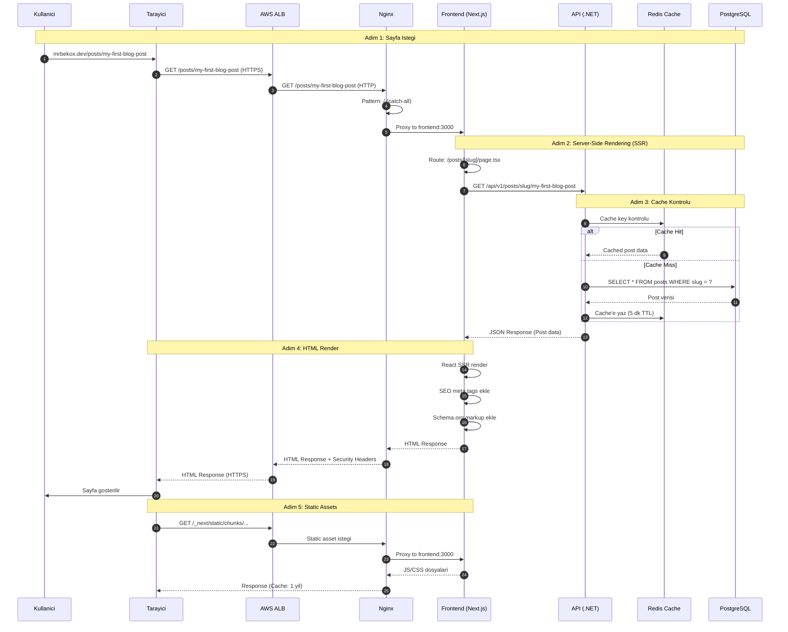

### Detayli Açiklama

1. **Kullanici Istegi**: Kullanici tarayicida blog yazisinun URL'sini açar
2. **ALB SSL Terminasyonu**: HTTPS istegi HTTP'ye dönüsturulur
3. **Nginx Routing**: `/posts/*` pattern'i catch-all ile frontend'e yonlendirilir
4. **SSR Render**: Next.js server component'i çalisir
5. **API Çagrisi**: `fetchPostBySlug()` fonksiyonu backend API'yi çagirir
6. **Cache Kontrolu**: Redis'te 5 dakikalik cache kontrolu yapilir
7. **Database Sorgusu**: Cache miss durumunda PostgreSQL'den çekilir
8. **HTML Response**: Tam renderlanmis HTML kullaniciya gonderilir
9. **Hydration**: Client-side React hydration gerçeklesir

### Kullanilan Dosyalar

| Katman | Dosya | Islem |
|--------|-------|-------|
| Frontend | `src/app/posts/[slug]/page.tsx` | SSR page component |
| Frontend | `src/lib/server-api.ts` | `fetchPostBySlug()` |
| API | `Endpoints/PostsEndpoints.cs` | `GET /posts/slug/{slug}` |
| API | `Features/PostFeature/Queries/GetPostBySlugQuery` | MediatR handler |
| Infra | `Persistence/Repositories/EfCoreBlogPostRepository` | EF Core sorgusu |

---

## 5. Ornek Senaryo 2: Yeni Blog Yazisi Olusturma

Bu senaryo, admin panelinden yeni bir blog yazisi olusturmayi anlatmaktadir. Authentication gerektiren bir islemdir.

### Istek Akisi

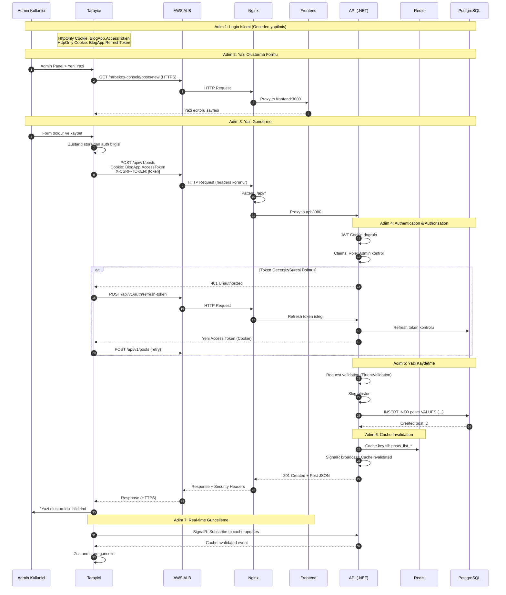

### Detayli Açiklama

1. **Authentication**: Kullanici önceden login olmali (HttpOnly cookie ile JWT)
2. **CSRF Koruması**: Her POST istegi X-CSRF-TOKEN header içermeli
3. **Authorization**: JWT claims üzerinden rol kontrolü (Admin, Editor, Author)
4. **Rate Limiting**: IP bazli rate limit kontrolu (300 req/min)
5. **Validation**: Request body FluentValidation ile dogrulanir
6. **Database Insert**: Post verisi PostgreSQL'e kaydedilir
7. **Cache Invalidation**: Ilgili cache key'leri temizlenir
8. **Real-time Sync**: SignalR ile diger clientlar bilgilendirilir

### Guvenlik Kontrolleri

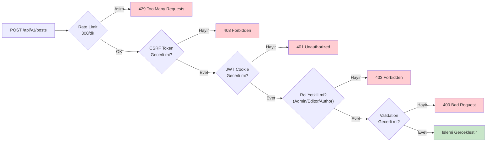

---

## 6. Ornek Senaryo 3: Arama Islemi

Bu senaryo, kullanicinin blog yazilari arasinda arama yapmasini anlatmaktadir.

### Istek Akisi

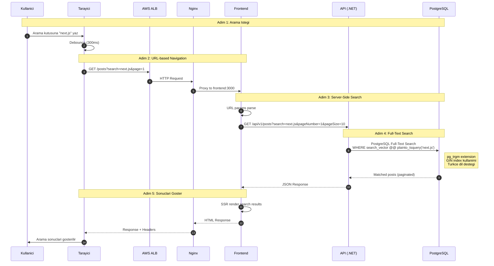

### PostgreSQL Full-Text Search Yapisi

```sql
-- Search vector trigger (otomatik guncelleme)
CREATE TRIGGER posts_search_vector_trigger
    BEFORE INSERT OR UPDATE ON posts
    FOR EACH ROW
    EXECUTE FUNCTION posts_search_vector_update();

-- GIN Index (hizli arama)
CREATE INDEX idx_posts_search_vector
    ON posts USING GIN(search_vector);

-- Trigram Index (fuzzy matching)
CREATE INDEX idx_posts_title_trgm
    ON posts USING GIN(title gin_trgm_ops);
```

---

## 7. Genel Istek Yonlendirme Diyagrami

Sistemin tum istek turlerini kapsayan genel akis diyagrami:

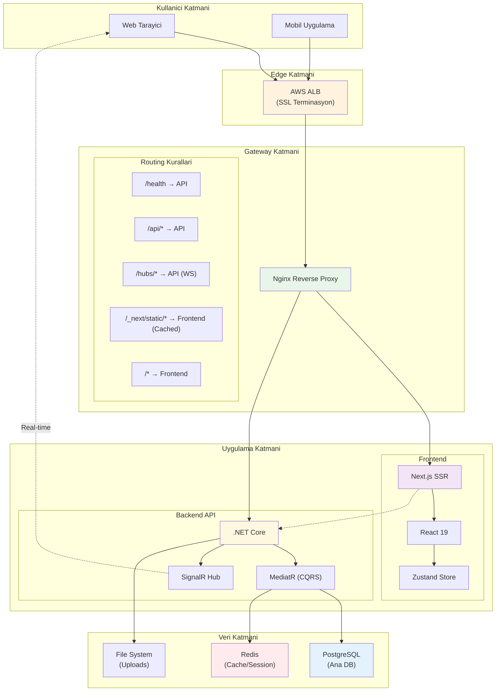

### Istek Turleri ve Akislari

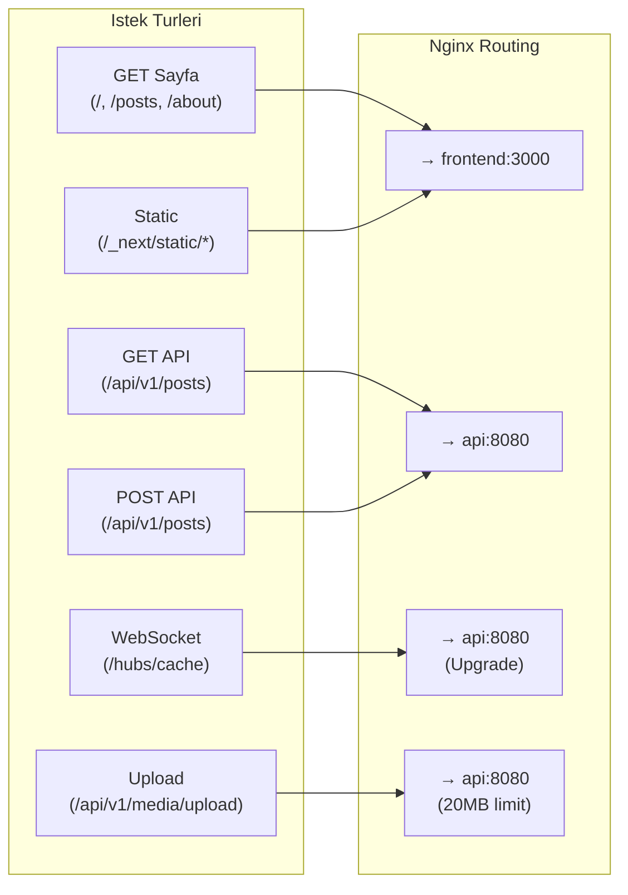

---

## 8. Guvenlik Mekanizmalari

### Katmanli Guvenlik Yapisi

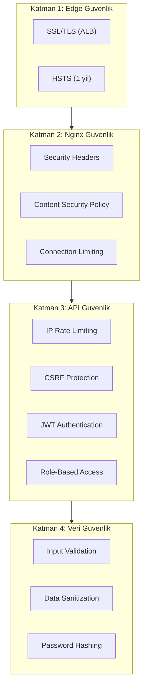

### Security Headers

| Header | Deger | Amac |
|--------|-------|------|
| X-Frame-Options | DENY | Clickjacking koruması |
| X-Content-Type-Options | nosniff | MIME sniffing koruması |
| X-XSS-Protection | 1; mode=block | XSS filtresi |
| Referrer-Policy | strict-origin-when-cross-origin | Referrer gizliligi |
| Strict-Transport-Security | max-age=31536000 | HTTPS zorunlulugu |
| Content-Security-Policy | [strict policy] | XSS/injection koruması |

### Rate Limiting Kurallari

| Endpoint | Limit | Periyot |
|----------|-------|---------|
| Genel | 300 | /dakika |
| Login | 5 | /dakika |
| Register | 10 | /saat |
| Image Upload | 10 | /dakika |
| Bulk Upload | 5 | /5 dakika |

---

## 9. Cache Stratejisi

### Cache Katmanlari

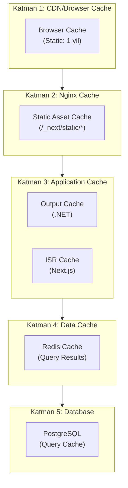

### Cache Sureleri

| Icerik Tipi | Sure | Katman |
|-------------|------|--------|
| Static Assets | 1 yil (immutable) | Browser/Nginx |
| Posts Listesi | 1 dakika | Output Cache |
| Post Detay | 5 dakika | Output Cache + Redis |
| Kategoriler | 10 dakika | Output Cache |
| Etiketler | 10 dakika | Output Cache |
| Sitemap | 1 saat | Output Cache |
| Robots.txt | 24 saat | Output Cache |
| RSS Feed | 30 dakika | Output Cache |

### Cache Invalidation

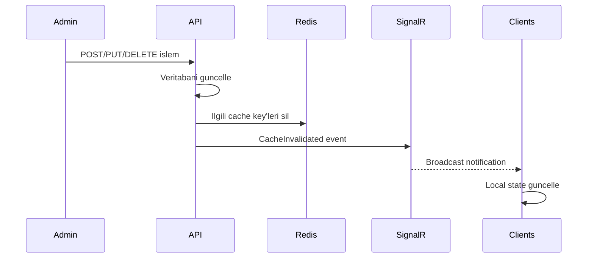

---

## Sonuç

Bu dokuman, MrBekoX Blog uygulamasinin nginx tabanli istek yonlendirme mekanizmasini kapsamli sekilde açiklamistir. Sistem, modern microservices mimarisi, katmanli guvenlik ve verimli cache stratejisi ile production-ready bir altyapi sunmaktadir.

### Temel Özellikler

- **Yuk Dengeleme**: AWS ALB ile HTTPS terminasyonu
- **Reverse Proxy**: Nginx ile akilli routing
- **SSR**: Next.js ile server-side rendering
- **Caching**: Cok katmanli cache stratejisi
- **Guvenlik**: HSTS, CSP, JWT, CSRF, Rate Limiting
- **Real-time**: SignalR ile anlık guncellemeler
- **Olçeklenebilirlik**: Docker container mimarisi

---

*Bu dokuman Claude Code tarafindan olusturulmustur.*
*Son guncelleme: 2026-01-14*
